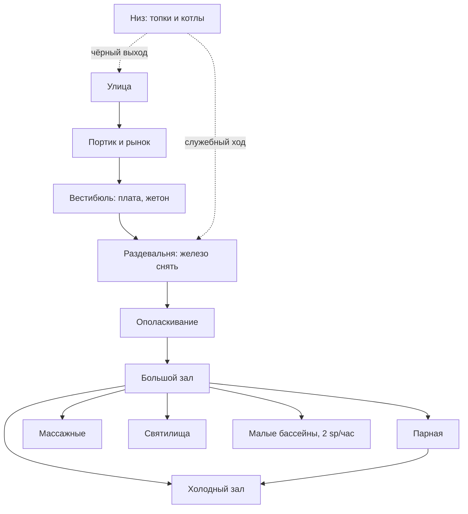

# Westgate Bathhouse / Бани Западных Ворот


> [!info]- Локация — [[Западные Ворота]], купольные общественные бани (Absalom CoLO, локация 220)
> **Тип:** общественные бани, открыты для всех сословий
> **Смотритель:** [[Дурвин Кеш]] — должность от районного совета, не собственник
> **Крыша:** [[Кровавые Цирюльники]] — держат раздевалку, рынок у портика и часть штата
> **Правило заведения:** железо не идёт дальше раздевалки. Никому. Никогда.

Купольная громада старше нынешнего города: снаружи — серый камень в подтёках, колоннада портика, вечный рынок под ней. Внутри темно, гулко и жарко, как в пещере, — свет падает столбами из отверстий в куполе, и в этих столбах видно пар. Сюда ходит весь Абсалом от лорда до ассенизатора, и это единственное место в городе, где действительно видно, что все устроены одинаково. Вещи ты отдаёшь приятному молодому человеку, который работает на воров.

---

## Описание

### Снаружи

- **Запах:** угольный дым от печей, мокрый горячий камень, дешёвое масло и жареное тесто с рынка
- **Шум:** торг и зазывалы под портиком; изнутри — глухой ровный гул и плеск, как из-под воды
- **Ориентир:** купол видно за три квартала; от полудня к портику стоит очередь

Древняя кладка, которую подновляли столько раз, что оригинала почти не осталось. Между колонн — лотки: масло, полотенца, костяные скребки, гребни, еда навынос. Вывески нет: зданию не нужна вывеска.

### Внутри (грубый план)

- **Портик и рынок** — торговые ряды между колоннами. Тесно, людно, тут работают карманники
- **Вестибюль** — плата за вход, выдают глиняный жетон с номером ниши
- **Раздевальня** — ниши в стене в три яруса, лавки, служитель при вещах. Здесь снимают всё, включая оружие
- **Холодный зал** — мелкие бассейны с ледяной водой, самое шумное место, сюда прыгают на спор
- **Большой зал** — сердце бань: огромный бассейн тёплой воды под куполом, эхо, здесь говорит весь район
- **Парная** — горячий зал, видно на пять шагов, пол обжигает, без деревянных сандалий не зайти
- **Массажные** — шесть тесных келий с лежаками, запах масла и пота
- **Святилища** — четыре тёплые ниши, подогрев снизу. Ни алтарей, ни символов: стены сплошь в табличках (см. ниже)
- **Малые бассейны** — шесть приватных комнат со своими дверями, за отдельную плату
- **Низ** — топки, водогрейные котлы, цистерны, ходы под полом. Гостям туда нельзя, и оттуда же свой вход для тех, кому не надо через вестибюль


### Схема

```
                       С Е В Е Р
  +==============================================+
  |  СВЯТИЛИЩА - 4 пустые ниши, стены в табличках|
  +----------------+--------------+--------------+
  |   МАССАЖНЫЕ    |              |    МАЛЫЕ     |
  |    6 келий     |   БОЛЬШОЙ    |   БАССЕЙНЫ   |
  |   масло, пот   |     ЗАЛ      | 6 приватных  |
  +----------------+  под куполом +--------------+
  |     ПАРНАЯ     |    тёплый    |   ХОЛОДНЫЙ   |
  |  горячий зал   |   бассейн,   |     ЗАЛ      |
  |  сандалии!     |     эхо      |   ледяные    |
  +----------------+------+-------+--------------+
  |       РАЗДЕВАЛЬНЯ     |    вёдра для         |
  |  ниши в 3 яруса, Пиппо|    ополаскивания     |
  +-----------------------+----------------------+
  |   ВЕСТИБЮЛЬ - плата, глиняные жетоны         |
  +=====================+========================+
                        |
               ПОРТИК И РЫНОК -> улица
                       Ю Г

  НИЗ (под всем зданием): топки, котлы, цистерны,
  ходы под полом, служебный выход наружу. Ирл.
```

**Маршрут гостя и связи залов:**



**Что важно за столом:**
- **Одна дверь наружу для гостей** — вестибюль. Второй выход только через низ, и он не для публики.
- **Раздевальня — бутылочное горлышко.** Через неё проходят все, и на входе, и на выходе. Всё, что случится с вещами, случится тут.
- **Большой зал — перекрёсток.** Из него попадают куда угодно, и через него видно почти всё. Кто сел у бассейна, тот видит, кто куда пошёл.
- **Приватные комнаты по дальней стене** — чтобы пройти к ним, надо пересечь большой зал на виду у всех.


### Святилища и таблички

Четыре ниши в северной стене: свод, подогретый пол, масляная лампа, чаша с водой. **Ни статуй, ни символов, ни имён.**

Ставить перестали века назад, и не из принципа веротерпимости, а по опыту: бани пережили столько смен веры, что любой поставленный знак через поколение оказывался чужим — и его рано или поздно разбивали. Проще стало не ставить вовсе.

Вместо алтарей — **стены в табличках**, в несколько слоёв, за века: свинец, олово, глина, дерево, кость. Крепят гвоздиком, шнурком, воском. Каждый пишет своему богу сам, и никто не спрашивает, кому именно. Объясняют это одной фразой:

> *«Пиши. Боги услышат — сами разберутся между собой.»*

**Три обычая, один материал:**

| Куда | Зачем |
|---|---|
| **На стену** | Просьба или благодарность. Самое обычное |
| **В воду** | Проклятие тому, кто обокрал. Свернуть и бросить в большой бассейн |
| **Под лампу** | За мёртвого. Кладут под лампу и ждут, пока прогорит масло. Прогорело — просьба ушла |

**Чужую табличку не трогают.** Не читают вслух, не снимают, не выносят. Это единственное, за что в нишах бьют — и бьёт снова зал, а не охрана. Когда вешать становится некуда, старый слой снимают и **топят в бассейне**, а не выбрасывают: дно большого бассейна — архив в несколько веков.

**Правило ниш:** не лить кровь и не жечь дымное. Не из благочестия — вода и пар тут общие.

Писать за неграмотных и подсказывать формулу — работа [[Эвриан|Эвриана]]. Он не служит ни одному богу; он профессионал по чужой вере.

**Что читается на стене**, если разглядывать: *«верни пояс, и я верну тебе руку»* · *«за Талию, чтобы дышала»* · *«чтоб у взявшего отсохло по локоть»* · *«спасибо, услышал»* — последних, без подробностей, больше всего.


---

## Правило, за которое бьют

**Железо остаётся в раздевалке.** Ни меча, ни ножа, ни брони дальше ниш — без исключений для стражи, жрецов, чиновников и приезжих героев.

Держит это правило не охрана, а сам зал. Полсотни голых людей очень не любят одного одетого с оружием, и реагируют они быстрее, чем успевает вмешаться смотритель. Вошедшего с железом сначала облают, потом обступят, потом вынесут — и никто потом не вспомнит, кто именно бил.

**Второе правило, помягче:** в бассейн не лезут грязными. Сначала ополаскивание из ведра у входа в зал. За нарушение не бьют, но ор стоит такой, что проще ополоснуться.

---

## Услуги и цены

| Услуга | Цена | Примечание |
|---|---|---|
| Вход, общие залы | 1 cp | Весь день, сколько высидишь |
| Полотенце, масло, скребок напрокат | 1 cp | Своё приносить не зазорно |
| Хранение вещей у служителя | 1 cp | Ничего не гарантирует (см. ниже) |
| Бритьё или стрижка | 2 cp | Работают цирюльники — те самые |
| Растирание и скребок (банщик) | 2 cp | Сток делает молча и жёстко |
| Массаж | 3 cp | Простой, руками |
| Массаж с маслами и умащением | 1 sp | Час, с разговорами |
| Табличка свинцовая | 1 cp | На стену, в воду или под лампу |
| Табличка оловянная, поприличнее | 5 cp | Для просьб, которые не стыдно показать |
| Надпись рукой Эвриана | 1 cp | Он же подскажет формулу |
| Малый бассейн (приватная комната) | 2 sp/час | Сюда приходят не мыться |
| Малый бассейн на вечер | 1 gp | Недельный заработок работяги |

### Ориентировочный счёт

| Ситуация | Сумма |
|---|---|
| Просто помыться, со своим полотенцем | **1 cp** |
| По-человечески: вход, полотенце, растирание | **4 cp** |
| Полный день как господин: вход, масла, массаж, бритьё, еда с рынка | **~2 sp** |
| Разговор наедине: вход на пятерых + комната на два часа | **~4 sp 5 cp** |

---

## Штат

- **[[Дурвин Кеш]]** — смотритель, человек, ~60. Родился в этих банях: мать была банщицей, он вырос у котлов. Знает в лицо половину района и почти никого по имени — обращается «уважаемый», «дорогая», и это не грубость, а тридцать лет практики. Отвечает за здание перед районным советом, а не за то, что в нём происходит.
- **Пиппо** — хранитель ниш, варисиец, 19, быстрый и обаятельный, помнит номер жетона по лицу. Вещи бережёт честно — **кроме тех, на кого укажут**. Работает на [[Кровавые Цирюльники|Цирюльников]] и считает это обычной подработкой.
- **Наира** — массажистка, гарундийка, ~40, руки как тиски, говорит без умолку. Знает, у кого какие шрамы, долги и любовницы, потому что люди под её руками болтают. **Главный источник слухов в этой части города.** За полсеребра расскажет много, за золотой — расскажет и про тебя кому-нибудь ещё.
- **Сток** — банщик-натиральщик, полуорк, ~35, молчун. Трёт скребком так, что клиенты шипят. Первым выходит на того, кто полез в зал с железом.
- **Ирл** — истопник, человек, ~50, руки в старых ожогах, наверх почти не поднимается. Держит топки и цистерны. **Знает служебный вход снизу и кто им пользуется по ночам** — и не расскажет, пока не поймёт, зачем.
- **Эвриан** — жрец-подёнщик, старик, храма за ним нет. Обходит святилища, принимает подношения за любого бога, за медь подскажет, какому именно молиться по твоей беде. Продаёт свинцовые таблички и помогает составить проклятие — грамотно, с формулой.

---

## Ритм дня

**Утро, от рассвета.** Приходят те, кто отработал ночь: рыбаки, докеры, ассенизаторы, ночная стража. Вода чистая, народу мало, разговоры тихие и усталые. Лучшее время, если хочешь, чтобы тебя не видели.

**Сиеста, после полудня — час пик.** Битком. Очередь под портиком, в большом зале не протолкнуться, эхо такое, что соседа слышно хуже, чем человека через зал. Сюда сходится весь район — мыться, трепаться, договариваться о мелком. Слухи собираются легко, приватности нет никакой.

**Вечер.** Толпа схлынула, остались те, кто пришёл не мыться. Все шесть приватных комнат заняты. В большом зале человек десять, и все друг друга разглядывают.

**Ночь.** Для публики закрыто, печи не гасят — остывший гипокауст растапливать двое суток. Внутри уборщики, Ирл у топок и те, кому нужен вход без свидетелей.

---

## Что отсюда можно вынести

- **Слухи.** Сбор информации: в сиесту DC ниже (говорят все и обо всём), но это базарный уровень — кто с кем спит и почём нынче рыба. Вечером DC выше, зато слухи предметные: кто кого ищет, кто внезапно при деньгах.
- **Наира** — постоянный контакт-сплетник, если с ней поладить. Работает в обе стороны: что расскажешь ты, тоже пойдёт дальше.
- **Эвриан** — вход к храмовой мелочи города и к практике проклятий.
- **Ирл** — ключ к подвалу и служебному входу. Дорогой контакт, но единственный способ попасть внутрь ночью.
- **«Чистый вид».** Опциональный хоумрул: после полной процедуры (вход, масла, бритьё — около 1 sp) персонаж до конца следующего дня получает **+1 ситуативный бонус на Дипломатию и Обман в приличном обществе**. Обратная сторона уже работает по факту: партия, пахнущая Лужами, в богатых кварталах читается мгновенно.

---

## Крыша и лестница последствий

Формально бани — городская собственность, смотритель отчитывается перед районным советом. Фактически раздевалка, рынок у портика и часть штата — [[Кровавые Цирюльники|Кровавых Цирюльников]], сильнейшей воровской гильдии Абсалома. Они держат почти все цирюльни города и изрядную долю бань; во главе алхимик **доктор Бенси Скуле**.

Если партия начинает буянить:

1. **Слово.** Дурвин подходит и просит по-хорошему. Один раз.
2. **Зал.** Если не помогло — вмешиваются посетители. Не бьют, но обступают и выдавливают. Против голой толпы плохо работает почти всё.
3. **Банщики.** Четверо со скребками и палками, во главе Сток. Знают помещение, знают, где скользко. Минута.
4. **Цирюльники.** Ещё десять минут — и с рынка приходят трое с бритвами. Спокойные, деловые, разговаривают вежливо.
5. **Назавтра.** Адресный ответ: у тебя пропадает то, чем ты дорожишь, или у твоего жилья появляется интерес. При рецидиве — «багровое бритьё», перерезанное горло.

⚠️ Обратная сторона той же монеты: **баня — единственное место в городе, где ты гарантированно голый и без вещей.** Всё, что ты принёс, лежит в нише у человека, который работает на воров.

---

## Быт

- **Вода и пар.** Цистерны наверху, котлы внизу, полы и стены прогреваются снизу через пустоты. Топят углём и обрезками корабельного дерева; дым уходит в стенные каналы и наружу над куполом.
- **Чем моются.** Мыла нет. Натираются маслом и соскребают костяным или бронзовым скребком вместе с грязью. Богатые приносят своё масло, бедные берут общее, прогорклое.
- **Куда девается грязная вода.** В стоки под полом, оттуда в городскую канализацию. В сильный дождь пахнет обратно.
- **Свет.** Отверстия в куполе и масляные лампы в нишах. В парной света почти нет — там ориентируются на голос.
- **Вещи.** Ниша с жетоном, служитель за монету. Кражи — обычное дело, и все об этом знают.
- **Таблички.** На дне большого бассейна и в стоках лежат свёрнутые свинцовые пластинки — проклятия тем, кто украл, и снятые со стен старые слои просьб. Их топят веками и не вычищают: вынуть чужую табличку — забрать её себе. Подробнее — раздел «Святилища и таблички».
- **Еда.** Внутрь не носят, едят на портике с лотков: жареное тесто, солёная рыба, дешёвое вино.
- **Если кому-то плохо.** Из парной выносят на руках в холодный зал и обливают. Раз в месяц кто-нибудь так и не приходит в себя — банщики выносят тело через низ, чтобы не пугать зал.

---

## Случайные события (d6)

1. **Спор за место** в горячем углу: двое докеров против клерка, который сидит там второй час. Спор идёт на голосах, но зал уже заинтересовался.
2. **Детский день.** Женщина привела троих, младший визжит и лупит по воде ладонями. Половина зала в бешенстве, вторая половина умиляется.
3. **Пропажа.** Крик в раздевалке: у человека нет пояса с деньгами. Пиппо божится всеми богами, что не отходил. Жетон на месте, ниша пуста.
4. **Переговорщики.** Пара снимает приватную комнату, и это явно не любовное свидание: оба одеты не по-банному, оба нервничают. За дверью в зале сидят двое и ждут.
5. **Эвриан подсаживается.** Старик оценивающе смотрит и предлагает табличку: *«У тебя на лице написана несправедливость, уважаемый. Свинец дешевле мести.»*
6. **Из парной выносят.** Пожилому стало плохо, лежит серый, дышит плохо. Наира орёт, чтоб позвали лекаря. **Готовый вход для [[Бель (Настя)|Бель]].**

---

## Примечания ГМ

- **Оружие — это первая сцена.** Партия придёт вооружённой. Решение «отдать железо и жетон» надо проговорить вслух и поимённо: кто отдал, кто спрятал, кто вообще не пошёл внутрь. Дальше всё строится на этом.
- **Пиппо не злодей.** Он искренне приветлив и правда бережёт вещи. Просто раз в неделю ему говорят, чью нишу не заметить. Если партия его расколет — он испугается по-настоящему, потому что Цирюльников боится сильнее, чем их.
- **Наира болтает не из вредности.** Она держит в голове полрайона и обменивает информацию как валюту, честно: рассказала — значит, и о тебе расскажет. Это нормально и она этого не скрывает.
- **Дурвин не крыша и не жертва.** Он тридцать лет держит здание на плаву и точно знает, чего не замечать. Давить на него бесполезно, договариваться — можно.
- **Зал — действующее лицо.** В любой сцене здесь есть полсотни голых свидетелей. Любая драка, любой крик, любое заклинание будут обсуждать весь вечер и весь следующий день.
- **Приватные комнаты — не декорация.** По канону их снимают для переговоров. Что бы партия ни подслушала за соседней дверью — это честно, а не подарок ГМа.

---

## Что там случилось (по сессиям)

*Пока пусто — партия здесь не была.*

---

## Промпты на арты

Стиль и якоря по `Assistant Guides/13__Генерация_локаций.md`. Четыре кадра.

**1. Фасад с портиком и рынком**
```
Exterior of a massive ancient domed public bathhouse in a crowded fantasy city,
fantasy RPG location art in the style of Dungeons & Dragons official artwork.
Weathered grey stone dome streaked with centuries of water stains, a colonnaded
portico of thick worn pillars, small market stalls crammed between the columns
selling oil flasks, folded towels, bone scrapers and combs, steam venting from
roof openings, wet flagstones, narrow city street, tall crowded buildings behind.
Overcast afternoon light, damp air, warm steam against cold grey stone,
lively and worn.
No text, no signs, no writing. No people, no characters, no figures.
Wide panoramic view, 16:9 aspect ratio.
```

**2. Большой зал с бассейном**
```
Interior of an enormous ancient domed bath hall, fantasy RPG location art in the
style of Dungeons & Dragons official artwork. A huge rectangular soaking pool of
still warm water set into a worn stone floor, massive pillars supporting a high
brick dome, shafts of daylight falling through round openings in the dome and
cutting through drifting steam, low stone benches along the walls, bronze water
spouts, mosaic fragments worn smooth underfoot, dark wet stone.
Dim cavernous light, columns of pale daylight in steam, echoing and solemn.
No text, no signs, no writing. No people, no characters, no figures.
Wide panoramic view, 16:9 aspect ratio.
```

**3. Парная**
```
Interior of a hot steam room in an ancient stone bathhouse, fantasy RPG location
art in the style of Dungeons & Dragons official artwork. Low vaulted brick
ceiling, tiered stone benches slick with condensation, a shallow basin of
scalding water, thick steam reducing visibility to a few feet, wooden sandals
left by the doorway, a single small opening high in the wall, heat shimmer,
dark sweating stone walls.
Almost no light, a faint dim glow through dense steam, oppressive and hot.
No text, no signs, no writing. No people, no characters, no figures.
Wide panoramic view, 16:9 aspect ratio.
```

**4. Приватная купальня**
```
Interior of a small private bathing room in an ancient stone bathhouse, fantasy
RPG location art in the style of Dungeons & Dragons official artwork. A small
sunken pool of clear warm water, ornate old tilework on the walls, two low
couches with worn cushions, a low table with a wine jug and two cups, a heavy
closed wooden door, an oil lamp in a wall niche, thick stone walls muffling
everything.
Warm amber lamplight on wet tile, intimate, private, faintly conspiratorial.
No text, no signs, no writing. No people, no characters, no figures.
Wide panoramic view, 16:9 aspect ratio.
```

Слаги для заливки: `bani-zapadnyh-vorot-fasad`, `bani-zapadnyh-vorot-zal`, `bani-zapadnyh-vorot-parnaya`, `bani-zapadnyh-vorot-privatnaya`

---

## См. также

- [[Западные Ворота]] · [[Кровавые Цирюльники]]
- [[Дурвин Кеш]] · Пиппо · Наира · Сток · Ирл · Эвриан — NPC-файлы TBA

---

## Название — на выбор ГМа

**Каноничное:** Westgate Bathhouse / Бани Западных Ворот.

Народные прозвища, если нужно живое слово за столом:
1. **«Купол»** — как называют местные, коротко и по факту
2. **«Старый Котёл»** — по печам внизу, которые не гасят никогда
3. **«Пар»** — «пошли в Пар», самое разговорное

---

## Поисковые якоря

#локация #Абсалом #ЗападныеВорота #бани #КровавыеЦирюльники #Арка2

---

*Канон: Absalom, City of Lost Omens, локация 220 (Westgate district). Бытовой слой — римско-британская банная модель (Aquae Sulis): свинцовые таблички-проклятия, масло и скребок вместо мыла, кражи в раздевалке как норма.*
