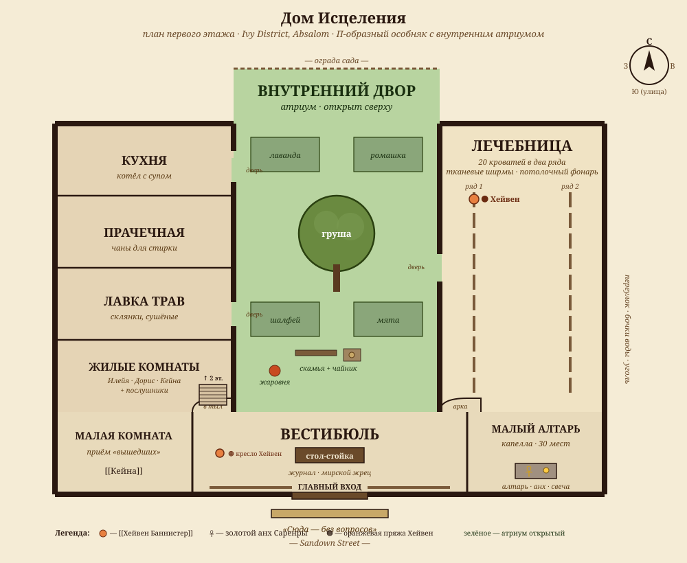
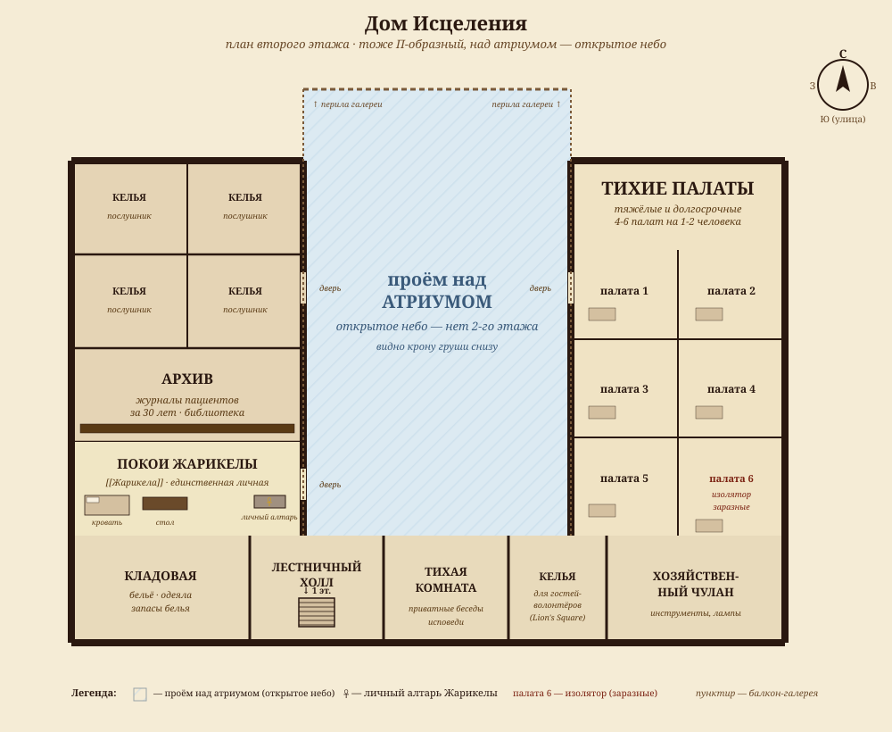

# House of Healing (Дом Исцеления)

Большой храм Саренры в восточной части Плющевого квартала. Стены покрыты яркими свирлевыми муралами от лучших местных художников, дверь не закрывается ни перед кем. Лечат любого, кто пришёл, без вопросов — за это их любят, за это же их и не любят.

## Описание

### Снаружи

Здание не похоже на ортодоксальный храм. Это **двухэтажный дом** с прилегающими крыльями, бывшая особняковая постройка, переделанная под лечебницу. Фасад полностью **покрыт муралами**: восход солнца, женщина с раскрытыми крыльями огня, рука, протянутая к падающему. Каждые несколько лет художники Плющевого квартала бесплатно обновляют свежие сцены поверх старых — рисуют по выходным, иногда несколько мастеров сразу. Над главным входом — **золотой анх** Саренры, потёртый от непогоды, никто не золотит заново.

У ворот — **скамья из светлого дерева** для тех, кто пришёл и ждёт. На ней почти всегда кто-то сидит: пациент, родственник, послушник на перерыве. Над скамьёй — **бронзовая табличка**: *«Сюда — без вопросов»*. На талданском.

В переулке справа — **бочки с водой и мешки с углём**. Они для всех — кто хочет, может взять. Кто-то ставит сверху записки благодарности.

- **Запах снаружи:** травы, чистая постель, иногда дым жаровни (на улице греют отвары)
- **Шум:** утром — голоса послушников, днём — стук колёс лечебных тележек, вечером — иногда пение (хор без репетиций)
- **Ориентир:** в восточной части Плющевого квартала. Идёшь по [[Sundown Street|Сандаун-стрит]], сворачиваешь на восток — муралы видно за квартал

### Внутри

Здание делится на **четыре зоны**, разделённых не стенами, а пространством:

**Главный зал (вестибюль).** Сразу при входе — широкое помещение с лавками вдоль стен и низким столом-стойкой посередине, за которой сидит дежурный мирской жрец. Сюда заходят все: пациент, паломник, проезжий с занозой. Дежурный записывает имя и причину в журнал — но **только** потому что иначе не отследить лечение. Никаких официальных записей в город не уходит. На стенах — росписи: солнце, восход, рассвет, восход, рассвет. У каждой росписи — стилизация другой школы.

**Лечебница.** Через арку из вестибюля — длинный зал с двадцатью кроватями, ширмы между ними. Свет дневной с потолочного фонаря, ночью — масляные лампы. Здесь лечат от ран, болезней, ядов. Заведует — **[[Илейя Дамар]]**, ветеран мирной работы, видела всё.

**Малый алтарь.** Справа от вестибюля — небольшая капелла на 30 мест. Алтарь — простой каменный стол с золотым анхом и неугасимой свечой. Здесь служат утренние молитвы и принимают тех, кому нужно духовное, не телесное. Свечу зажигают рано утром, гасят на закате — кроме службы за умирающего пациента, тогда не гасят.

**Тыловая часть.** За лечебницей — **кухня** (готовят соупы для бесплатной раздачи и для пациентов), **прачечная**, **лавка трав**, **жилые комнаты** для постоянного персонала и послушников. Внутренний двор с садом лекарственных трав и старой грушей в центре.

### Второй этаж

Тоже П-образный (над двумя крыльями и фасадом, **над атриумом — открытое небо**). Четыре функциональные зоны:

**Покои Жарикелы** (над жилыми комнатами в западном крыле). Единственная личная комната главы Дома. Скромная: письменный стол, небольшая кровать, маленький личный алтарь Sarenrae для уединённой утренней молитвы, окно во двор. Жарикела часто слышит атриум из окна — это её способ «знать что в Доме» не спускаясь.

**Спальни послушников** (5-7 келий). Маленькие комнаты, по одному-два на келью, скромные — кровать, сундук, полка. Двое талданцев из Lion's Square, полуэльфийка из Кадиры, юноша-сирота из Лужь.

**Архив и комната записей** (над лавкой трав/прачечной). Журналы пациентов за тридцать лет, медицинская библиотека, переписка с саренритами других городов. Илейя проводит здесь часть утра, сверяя записи; послушникам сюда заходить только по разрешению.

**Тихие палаты** (восточное крыло, над лечебницей). Для **тяжёлых и долгосрочных** пациентов, которым нужно уединение от шума общего зала. 4-6 отдельных комнат на 1-2 человека. Носилки поднимают по лестнице с площадкой. Сюда же кладут пациентов с заразными болезнями (одну палату специально под изоляцию).

> [!info]- Сюжетный смысл 2-го этажа
> 2-й этаж — **тихий**. Если Жарикела хочет говорить с партией приватно — поведёт наверх в свои покои. Это сигнал «серьёзный разговор». Если кто-то из партии серьёзно ранен и остаётся в Доме надолго — поднимут в тихую палату. Архив — потенциальная зацепка для расследований (Хейвен помнит устно, журналы хранят письменно). Хейвен сюда **не поднимается** — ноги не держат, она навсегда внизу.

- **Запах внутри:** свежевымытое полотно, ромашка, шалфей, подгоревшая каша из кухни
- **Шум:** тихий гул голосов, иногда стон или плач пациента, шарканье шагов по крашеному дереву
- **Свет:** дневной во всех общих помещениях; в лечебнице ночью лампы стоят за тканевыми экранами, чтобы не слепить лежачих

## Что Дом делает

**Лечение бесплатно для всех.** Это **обет** Дома, не маркетинг. Ни денег, ни верительных грамот, ни вопросов о происхождении не спрашивают. Жертвовать можно — но никто не подталкивает.

**Работа с бывшими рабами.** Координирует **[[Кейна]]**. Юридическая помощь, временное жильё, поиск работы. Это активистская сторона Дома — и за неё в Дом летят камни (фигурально, иногда буквально). Главный враг — [[Леди Сейчия|Леди Сейчия из дома Тевинег]] и её Соляной картель в Лужах.

**Восстановление заброшенных районов.** Дом тратит ресурсы на ремонт жилья, чистку улиц, подъём низовой инфраструктуры в Лужах и других бедных районах. Это раздражает богатых соседей в самом Плющевом квартале — но соседям важнее **внешний вид района** чем политика, и пока стены вандалят и быстро восстанавливают, всё мирно.

**Healing Raft в Лужах.** Выездная миссия. **[[Плавучий храм]]** — маленький плот с командой клериков и котлом супа, заходит в Лужи каждый второй день на низком приливе. Lay priest на плоту — **[[Энис Салар]]** (он же координирует Лужи на земле). Жители Луж стекаются к плоту, ресурсы кончаются за час.

**Координация с Lion's Square.** Талданская диаспора в [[Foreign Quarter|Иностранном квартале]] (Lion's Square) — корни активизма Дома. Многие талданские Сарениты бежали из Талдора при Великой Чистке Stavian I; их потомки и формируют активистскую ветку Sarenrae в Абсаломе. Дом получает оттуда волонтёров, иногда — прямые пожертвования талданских купцов-эмигрантов.

## Отношения с Temple of the Shining Star

В [[Ascendant Court|Восходящем Дворе]] стоит **[[Temple of the Shining Star]]** — крупнейший храм Саренры к северу от Катеера. Им заправляет **[[Lady Xerashir]] of House Shamyyid**, Bey of Sarenrae и Watcher of the Starstone. Это **другая** Sarenrae: формальная, политическая, секулярная. Xerashir свою роль воспринимает как **в основном гражданскую** — Sarenrae для неё это институция, не движение.

Между Домом и Храмом нет вражды. Но есть **постоянное идеологическое расхождение**, проявляющееся в мелочах:

- **Dawnstar Angels** — это **формальные** миссионеры Xerashir, объезжают город из Восходящего Двора. Когда они заходят в Лужи, координатор Энис должен **формально согласовать** маршрут с командиром Dawnstar Angels — иначе наступают друг другу на пятки. Согласование вежливое, но всегда **чуть холодное**.
- **Доктринальные разногласия.** Жарикела учит послушников более **прощающей**, талданской традиции Саренры (вторые шансы, искупление, активная мерсия). Xerashir держит **кадирскую**, более ортодоксальную линию (правосудие как часть мерсии, формальное искупление). На общих собраниях в Восходящем Дворе они обмениваются вежливыми кивками, не ужинают вместе.
- **Деньги.** Xerashir формально — выше по иерархии (главный храм). Но пожертвования талданской диаспоры идут **напрямую** в Дом, минуя Храм. Это раздражает финансистов Xerashir. Жарикела молчит и переводит деньги дальше — в Лужи, в работу с бывшими рабами, на ремонт.
- **Watcher of the Starstone.** Xerashir — официальный наблюдатель Старстоуна. Это её главная **политическая** функция. Дом к Старстоуну никакого отношения не имеет — что подчёркивает: Xerashir — фигура **высокая**, Дом — фигура **низовая**.

**Если партия попадёт к Xerashir** (через Дом, через знакомство, через Ascendant Court) — она будет **вежлива**. Поможет, если попросят. Но **не приблизит** — у неё на Дом тёплое, чуть снисходительное отношение, как у старшей сестры на младшую, которая «рисует муралы вместо того чтобы вести дела».

## Кто здесь работает

### Жарикела (Zharichela) — High Priestess

**Гномка**, ~80 лет (для гнома — молодая зрелая). Главная жрица Дома уже два десятка лет. Ниже остальных клериков на голову с лишним, но её слово — закон, когда она появляется. Не ведёт ежедневную работу — это делегируют. Но появляется, когда вопрос **принципиальный**: пришла угроза, пришла власть, пришёл сложный пациент.

**⚠️ Несколько месяцев назад** изгнала из Дома **суккубу**, проникшую под видом прихожанки. С тех пор повышенно бдительна — тайно использует *Detect Alignment* при первой беседе с новыми посетителями, чувствует демоническое резонанс на предметах (включая молот Анканто через Worldwound-связь).

См. [[Жарикела]].

### Энис Салар — Lay Priest, Координатор Луж

Талдан-мигрант, ~52 года, мирской жрец Саренры. Координирует **Healing Raft** в Лужах и сухопутную мерсию. Ветеран **Мендева** — пять лет в крестовом походе против демонов Worldwound, оттуда хромота на левую ногу и не любит закрытые двери.

Главный канал партии в Дом и в Лужи. Знаком лично с **[[Лорд Ямтар|лордом Ямтаром]]** (Дом Ормуз — донор), может познакомить. Близкий друг **[[Хоуп]]** (приют Чистой Воды в Лужах) — ходят пить чай раз в неделю.

См. [[Энис Салар]].

*Канонически: Eligir Kelm. В нашей кампании — Энис Салар, та же роль, та же история.*

### Илейя Дамар — Заведующая Лечебницей

Полу-эльфийка, ~55 лет. Спокойная, сухая, методичная. Прошла все ступени — от послушницы до заведующей. Никогда не выезжала из Абсалома. Спорит с Энисом без злобы: он рвётся **в** Лужи, она держит **дверь** Дома открытой. Оба правы.

См. [[Илейя Дамар]].

### Кейна — Координатор работы с бывшими рабами

Человек, ~38 лет, тёмная кожа, шрамы на запястьях (рабские). Сама бывшая рабыня — освобождена пятнадцать лет назад. Координирует юридическую и социальную помощь. Носит **scimitar + кинжал** на поясе, кожаную защиту под платьем — готова встать в дверях. **Прямой враг** Леди Сейчии — лично, не институционально. Каждое спасение раба из Соляного картеля — её личная победа.

См. [[Кейна]].

### Хейвен Баннистер (Haven Bannister) — постоянная пациентка

Старая женщина, ~75 лет, живёт в одной из палат лечебницы уже три года. Ноги отказывают, но руки в порядке — вяжет ярко-оранжевые шарфы для пациентов и послушников. Помнит **всех**, кого Дом лечил за последние 30 лет. Приют ей дали бесплатно, она в благодарность — общая бабушка Дома.

См. [[Хейвен Баннистер]].

### Послушники и младший персонал

5–7 послушников разного возраста и происхождения. Двое талданцев из Lion's Square, одна шахматистка-полуэльфийка из Кадиры, один молодой человек из Лужь (его подняли как сироту, теперь он работает в кухне). Пёстрая команда, держится на личной симпатии и общей цели.

## Расписание

**Утро.** До рассвета — Жарикела или старший послушник зажигает свечу в малом алтаре. Утренняя молитва коротка, для тех кто хочет (обычно 6–10 человек). Завтрак для пациентов и персонала. Энис проверяет журнал, планирует выезд Healing Raft если день плотовый.

**День.** Двери открыты. Пациенты приходят постоянно. Илейя обходит лечебницу. Кейна принимает в малой комнате при входе тех, кто пришёл по «другому» — освобождённых, беглых, испуганных. Послушники в кухне, в саду трав, в прачечной. К полудню в саду пьют чай (зелёный кадирский, талданский травяной, выбор).

**Вечер.** К пяти — обход лечебницы перед ночной сменой. Свечу в алтаре гасят с закатом. Вечерняя молитва короче утренней. Двери остаются открытыми до полуночи — на случай ночного экстренного.

**Ночь.** Дежурят двое — мирской жрец в вестибюле, послушник в лечебнице. Если что-то случилось — будят Илейю или Эниса (комнаты в тыловой части). Жарикелу будят только в крайнем случае.

## Случайные сцены (1d6 при заходе партии)

1. **Хейвен вяжет.** В вестибюле сидит старуха в кресле, вяжет ярко-оранжевый шарф. Знает всех. Если партия заговорит — расскажет историю любого, кого Дом лечил. У Сени — может оказаться, что Хейвен помнит Варена, заходившего сюда годы назад.
2. **Энис на пороге.** Энис как раз выходит на Healing Raft — приглашает партию пойти с ним в Лужи. Бесплатный мост в район, без формальностей.
3. **Споры на кухне.** Илейя и Энис у кухонного стола, тихо ругаются про распределение клериков. «Туда нельзя послать ещё одного, у нас сегодня две родовые». — «А плот не пойдёт пустой». Партия может вмешаться или подождать. Никто не сердится по-настоящему.
4. **Кейна с гостем.** В малой комнате при входе — Кейна с молодой женщиной со свежими шрамами на запястьях. Дверь приоткрыта. Партии лучше не заглядывать. Если заглянули — Кейна отвернёт, сухо. Доверие потом восстанавливать.
5. **Dawnstar Angels.** Двое **формальных** миссионеров Xerashir в белых плащах с золотой звездой стучатся согласовать маршрут в Лужах. Энис принимает их вежливо, разговор холодный. Если партия видит — поймёт, что между храмами **что-то есть**.
6. **Жарикела в зале.** Один раз, без предупреждения, через вестибюль проходит Жарикела. Тишина. Она кивает дежурному, идёт во внутренний двор. Через десять минут возвращается. Никто не комментирует. Её уважают по-настоящему.

## Примечания ГМ

- **«Без вопросов»** — это обет. Если партия попытается **взять** что-то из Дома (украсть лекарство, взять с собой не отдав), Жарикела **узнает** (не магически, через персонал) — и доверие будет потеряно. Пожертвование добровольно, кража — несовместима с этикой Дома.
- **Энис ↔ партия.** Главный канал. Через него партия попадает к Хоуп, к Лужам, к Ямтару (если нужно представить). Если партия его обидит — потеряет половину Абсалома.
- **Кейна ↔ Леди Сейчия.** Это не просто фоновое противостояние. Кейна может **просить** партию помочь с конкретным делом (спасти раба, найти доказательства). Это потенциальная нить **рабства** для Гельдалы (мотив, заявленный в Арке 1).
- **Жарикела как карманный билет.** Появление высшей жрицы — событие. Использовать редко: один раз когда нужна формальная санкция Дома.
- **Xerashir — зеркало.** Если партии Дом покажется «слишком хорошим» (что у нас в Арке 2 будет важно — Круг Syrvas работает похоже), Xerashir даст **другую** Sarenrae: формальную, политическую, секулярную. Контраст полезен для калибровки.

## Связи

- [[Плющевой квартал]] — район
- [[Жарикела]] — high priestess (NG Female Gnome Cleric 10)
- [[Энис Салар]] — lay priest, координатор Луж
- [[Илейя Дамар]] — заведующая лечебницей
- [[Кейна]] — координатор работы с бывшими рабами
- [[Хейвен Баннистер]] — постоянная пациентка, общая бабушка Дома
- [[Плавучий храм]] (Healing Raft) — выездная миссия в Лужи
- [[Хоуп]] (Приют Чистой Воды, Лужи) — близкая дружба через Эниса
- [[Лорд Ямтар]] (Дом Ормуз) — донор, лично знаком с Энисом
- [[Temple of the Shining Star]] (Ascendant Court) — главный храм Саренры, формальная иерархия
- [[Lady Xerashir]] — высшая жрица Temple of the Shining Star, идеологический оппонент Жарикелы
- **Lion's Square** (Foreign Quarter) — Талданская диаспора, корни активизма Дома
- [[Леди Сейчия]] (Соляной картель, Лужи) — прямой враг через Кейну

---

*Канонический источник: Absalom, City of Lost Omens, стр. 169 (локация 130, House of Healing); Temple Index стр. 85; Temple of the Shining Star стр. 104.*

*Канонические NPC: Zharichela (high priestess), Eligir Kelm (lay priest — у нас Энис Салар), Haven Bannister (parishioner), Zifelez of Gyr (parishioner).*

#ДомИсцеления #HouseOfHealing #ПлющевойКвартал #Саренрэй #Абсалом #Арка2
