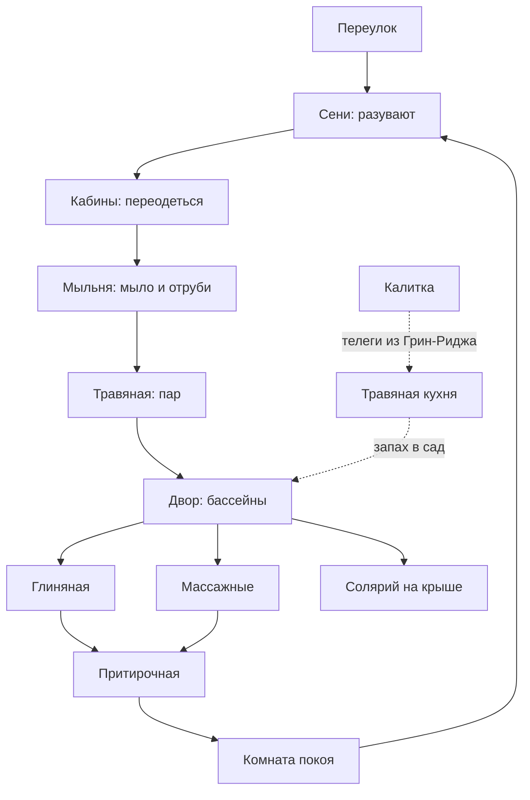

# Первоцвет


> [!info]- Локация — [[Плющевой квартал]], закрытый сад-спа при [[Конгломерат Парфюмеров|Конгломерате Парфюмеров]]
> **Тип:** банно-спа заведение высшего разряда, «зелёный люкс»
> **Держит:** [[Конгломерат Парфюмеров]], гранд-алхимик [[Аарнок Ксантисс]]
> **Персонал:** друиды Конгломерата, травницы, лешие
> **Правило заведения:** на клиента не накладывают заклинаний. Ни одного. Об этом говорят с гордостью.
> ⚠️ Заведения нет в Absalom CoLO — авторская локация на канонной гильдии.

За глухой стеной в переулке за Цветочной улицей нет вывески — только дверь и плющ по штукатурке, пущенный слишком ровными полосами, чтобы вырасти самому. За дверью город кончается. Внутри сад, которого не видно ни с одной улицы, и в нём тише, чем бывает в Абсаломе: небольшие бассейны в зелени, грядки, где каждая трава растёт на своей, и деревья, под которыми держат тень живые лешие. Здесь не делают вас другим человеком. Здесь три часа подряд занимаются тем человеком, которым вы уже являетесь, — и к вечеру вы впервые за годы видите в зеркале не усталость, а себя.

---

## Описание

### Снаружи

- **Запах:** с улицы ничего. Абсолютно ничего — и это первое, что странно в квартале, где пахнет всем сразу. Зато за дверью в лицо бьёт тёплой влажной зеленью, мокрой глиной и чем-то цветочным, чему нет названия.
- **Шум:** тишина. В Плющевом это противоестественно: вокруг уличные артисты, толпа, репетиции, а здесь глухо, как в погребе.
- **Ориентир:** переулок за [[Цветочная улица|Цветочной улицей]], глухая стена в плюще, дверь без вывески. Спросишь у прохожего — покажет не сразу, но покажет.

### Почему это выглядит именно так

[[Плющевой квартал]] — самый маленький по площади район города и самый плотно набитый. Земля здесь дороже, чем где-либо, и дворяне последний век скупают её под особняки с частными садами, выдавливая художников в переполненные общежития.

Поэтому **пустое место посреди Плющевого и есть главная вывеска.** Не позолота, а возможность не застраивать. Здание построено кольцом вокруг сада и смотрит внутрь, а не на улицу.

### Двор

- **Два малых бассейна** — тёплый у южной стены, прохладный в тени. Не для плавания, для сидения; в каждом помещается четверо, если по-дружески.
- **Шестнадцать грядок**, по траве на каждой, вдоль дорожек. С табличками, которые никто не читает, кроме травниц.
- **Солнечная поляна** — прогретая лужайка в углу, куда лешие приносят или убирают тень по слову.
- **Старая груша** посреди двора, старше здания. Её обходили, когда строили.

### Здание, по кольцу

- **Сени** — встречают, разувают, забирают верхнее. Ни кассы, ни очереди: платят на выходе.
- **Раздевальные кабины** — не общий зал, а шесть отдельных, с занавесью. За оставленным следят, но без демонстративной охраны: здесь это было бы оскорблением.
- **Мыльня** — тепло, вода, чёрное мыло, отруби, рукавицы.
- **Травяная** — комната пара, где на камни льют то, что при тебе срезали и заварили.
- **Три массажные кельи** — узкие, тёплые, лежак, окно в сад.
- **Глиняная** — прохладная, пять бочек разной земли по цветам.
- **Притирочная** — сердце заведения, см. ниже.
- **Комната покоя** — полутьма, лежаки, жаровни. Сюда уходят после всего и отсюда не хотят вставать.
- **Травяная кухня и сушильня** — служебное: котлы, сита, пучки под потолком. Гостям не сюда, но дверь всегда приоткрыта, и оттуда идёт запах.
- **Солярий на крыше** — плоская кровля с полотняными навесами, узкая лестница наверх.
- **Задний двор и калитка** — для телег с травой и цветами из [[Green Ridge|Грин-Риджа]]. Единственный второй выход.

### Схема

```
            переулок за Цветочной улицей
    ==================[ДВЕРЬ]==================
    |                  СЕНИ                   |   глухая стена в плюще
    +--------+---------------------+----------+
    | КАБИНЫ |                     |  МЫЛЬНЯ  |
    |   x6   |                     |          |
    +--------+       Д В О Р       +----------+
    |ТРАВЯНАЯ|   тёплый бассейн    | МАССАЖНЫЕ|
    |  (пар) |   старая груша      |    x3    |
    +--------+   прохладный б-н    +----------+
    |ГЛИНЯНАЯ|   16 грядок         |ПРИТИРОЧНАЯ|
    |        |   солнечная поляна  |          |
    +--------+---------------------+----------+
    | ПОКОЙ  |   ТРАВЯНАЯ КУХНЯ    | лестница |
    |        |   и сушильня        | на крышу |
    +--------+------[КАЛИТКА]------+----------+
                 задний двор, телеги

    НАВЕРХУ: солярий под полотняными навесами
```

**Маршрут гостя:**



**Что важно за столом:**
- **Одна дверь для гостей.** Вторая — калитка для телег, и через неё не ходят.
- **Двор виден отовсюду.** Все комнаты кольца смотрят окнами внутрь, и любой во дворе на виду у всего заведения. Приватность тут — в комнатах, а не в саду.
- **Притирочная последняя.** Маршрут построен так, чтобы клиент дошёл до полок с маслами распаренным и разнеженным. Это не гостеприимство, это торговля.

---

## Притирочная

Комната, ради которой это вообще гильдия парфюмеров.

Стены в полках от пола до потолка, и на полках **сотни горшков, склянок, флаконов и глиняных банок**, каждая с меткой, понятной только мастеру. Здесь не пахнет ничем — пока не откроют; это правило, и поэтому воздух в притирочной стоит холодный и пустой, как в аптеке.

Когда процедуры кончились, тебя приводят сюда мокрым, тёплым и распаренным, и мастер начинает открывать крышки одну за другой, поднося к твоему лицу.

Дальше сравнивают. **Розовая вода** — прозрачная, холодная, чистая до звона, будто кто-то распахнул окно. **Розовое масло** из того же цветка — густое, тяжёлое, сладкое почти до тошноты, и держится сутки. **Ирисовый корень** — сухая пудра, запах дорогого. **Нард** — тёмный, смолистый, взрослый. **Кедр** — как сухая доска на солнце.

Мастер не советует. Он **ждёт, на чём ты сам остановишься**, потому что, по здешнему убеждению, тело выбирает своё быстрее, чем голова.

Выбранным умащают на прогретую кожу. Это последнее, что с тобой делают, и уходишь ты уже пахнущим — в Абсаломе это читается за десять шагов, и читается как деньги.

---

## Правило дома

**На клиента не накладывают заклинаний. Ни одного.**

Ни лечебных, ни бытовых, ни по просьбе, ни за деньги. В городе, где магией чинят волосы, кожу, возраст и лицо, это заявление стоит дороже любого мрамора: наше искусство — вырастить, а не подменить. Если клиент колдует на себя сам, мастера отходят и ждут в стороне — не запрещают, но и рук не приложат. «Это не наша работа.»

**Второе, помягче:** во дворе не повышают голос. Не запрет, а обычай — но нарушившего попросят.

**Третье:** имён не спрашивают. В книгу вписывают только тех, кто заказал именной состав, — и это считается честью, а не учётом.

### Что бывает за нарушение

Здесь не бьют. Здесь **вежливо провожают и больше не записывают.**

В Плющевом квартале это тяжелее побоев: отказ Первоцвета обсуждают, и через неделю его знают все, кто здесь что-то значит. Человек, которого не пустили, не может даже объяснить за что — ему не сказали.

⚠️ **А теперь неприятное, для ГМа.** Заведение, которое славится тем, что тут не бывает магии, — это заведение, **чьи масла никто не проверяет на магию**. Гордость «мы не колдуем» и есть идеальное прикрытие для того, что задумал [[Аарнок Ксантисс|Ксантисс]]. Партия услышит это как приятную деталь сервиса; чем оно было на самом деле, дойдёт позже.

---

## Процедуры и цены

### Войти

**Порог — 5 sp.** Сад, оба бассейна, чай из того, что растёт на грядках, лежак под грушей и столько времени, сколько нужно. Персонал не подойдёт, пока не позовёшь. Многие платят эти полсеребра только за то, чтобы полдня никто с ними не разговаривал в городе, где говорят всегда.

*Для понимания: это десять дней труда чернорабочего. Здесь это порог, а не цена.*

### Водой и руками

**Мыльня — 4 sp.** Чёрное маслянистое мыло, от которого кожа делается скользкой и чужой, потом жёсткая рукавица. Первое движение — и с тебя сходит серыми катышками то, что ты носил на себе, не зная. Заканчивают пшеничными отрубями, сухими и скрипучими.

**Травяная — 6 sp.** Спрашивают, на что жалуешься, идут во двор и **срезают состав при тебе**. Заваривают, льют на камни. Дышишь ты именно своей смесью — и это главное отличие от любой другой парилки города, где на камни льют одно и то же для всех.

**Веничная — 1 sp за породу, 3 sp за все четыре.** Дуб — тёплая пыль и винно-кислое, прибивает жар к спине. Берёза — свежее, почти мятное, колет и бодрит. Ива — горькое, аптечное, от ломоты. Кедр — сухой и смолистый, как доска на солнце. Породу подбирают по жалобе, а не по вкусу, и спорить бесполезно.

**Массаж — 8 sp час, в четыре руки 15 sp.** Узкая тёплая келья, окно в сад, лежак. Разговаривают, только если начал ты.

**Пять земель — 6 sp за одну, 20 sp за все.** Глина по цветам: чёрная от ломоты, красная греет изнутри, белая стягивает лицо в маску, жёлтая вязкая и тёплая, синяя пахнет дном пруда. Лежишь в коконе, пока не высохнет коркой и не начнёт трескаться.

### Долгое

**Солнечная поляна — 3 sp полдня.** Прогретая лужайка за изгородью, лешие приносят и убирают тень по слову, вода и фрукты из сада. Самое дешёвое настоящее удовольствие здесь, и старики знают это лучше всех.

**Комната покоя — входит в любую процедуру.** Полутьма, жаровни, лежаки. Сюда уходят после всего и отсюда не хотят вставать. Переночевать — **10 sp**, и половина тех, кто платит, не собирались оставаться.

**Дымная — 8 sp.** Тёплая комната с жаровнями, в составе **флейлиф**. Официально — «от нервов и бессонницы». Пахнет тлеющим сеновалом, тяжелит веки, и время внутри идёт иначе.

**Сонное молоко — 15 sp за ночь.** Маковое молоко с мёдом, под присмотром травницы, с записью в книгу. Для тех, кто не спит третью неделю. Сон без сновидений и без возможности проснуться до утра.

> [!warning] Ни то, ни другое здесь не называют дурманом
> Это **процедуры**: их назначает травница, их записывают в книгу, и человек, который ходит сюда третий месяц, уверен, что лечится. По правилам PF2e флейлиф — наркотик с проверкой Стойкости на привыкание; статблок смотреть на AoN.

### Притирания и парфюм

Работа мастера — **8 sp**. Масло сверху, по выбору:

| Что | Цена | Каково |
|---|---|---|
| Простое травяное | 5 sp | Чистое, зелёное, держится до вечера |
| Кедровое | 12 sp | Сухое, смолистое, оседает в одежде |
| Ирисовое | 30 sp | Пудра, сухой фиалковый корень. Запах дорогого, и все его слышат |
| Розовое | 40 sp | Густое, сладкое до тошноты, держится сутки |
| Нардовое | 80 sp | Тёмное, смолисто-горькое. Взрослый запах, под ним теряются остальные |

**Что уносят с собой.** Флакон того же состава — от **10 sp** за простой до **10 gp** за именной: стекло Нового Тассилона, восковая печать с меткой Конгломерата и **имя, вписанное рукой мастера в гильдейскую книгу**. Запись важнее флакона: она значит, что состав сделан под тебя и повторить его могут только здесь. За это и платят.

**Живая оправа — 25 sp, с редкими цветами до 100 sp.** Лешие обвивают тебя цветущей лозой и вплетают живые цветы в волосы; держатся сутки, потом осыпаются. Для премьеры в театре, для свадьбы у святилища Шелин, для приёма, на котором надо быть увиденным.

### Только по записи

**Ночная роща — 200 sp за вечер.** После закрытия, во дворе, при свечах, один леший-прислужник и больше никого. Официально — «для тех, кому нужен покой». Фактически — единственное место в квартале, где можно говорить, зная, что не слышит вообще никто.

### Ориентировочный счёт

| Ситуация | Сколько |
|---|---|
| Просто прийти и посидеть в саду | **5 sp** |
| Обычный заход: порог, мыльня, пар | **1 gp 5 sp** |
| Полный день на одного, всё по кругу плюс простое масло | **около 3 gp 7 sp** |
| То же, но с нардом вместо простого масла | **около 11 gp** |
| Полный день на пятерых, по-скромному | **7–8 gp** |
| Полный день на пятерых, с хорошими маслами | **25–30 gp** |
| Вечер в Ночной роще | **20 gp** |

**Логика прайса.** Низ намеренно оставлен доступным: помыться по-человечески — полтора золотых, и это по карману кому угодно с деньгами. Зарабатывает заведение не на пороге, а на маслах, поэтому притирочная и стоит последней по маршруту. Верх при этом уходит в десятки золотых.

Для сверки: партия делила 250 зм на пятерых в начале С18. Свести компанию сюда на день — трата заметная, но не разорительная. А вот нард за восемь золотых или именной флакон за десять — уже не покупка, а поступок, и за столом это запомнят.

---

## Штат

Семеро: трое людей и четверо леших.

### Люди

**[[Ильсабет Ворн]]** — мастер притирочной и управляющая. Человек, ~45, прямая спина, руки в несмываемых пятнах от составов. Парфюмер [[Конгломерат Парфюмеров|Конгломерата]] с положением.
- **Манера.** Говорит мало и никогда не советует. Открывает склянки одну за другой и **ждёт**, на чём гость остановится сам. На «а что мне подойдёт» отвечает: *«Не знаю. Вы знаете.»*
- **Во что верит.** Что запах выбирает тело, а не голова. Что заклинание на клиенте — признание в собственном бессилии. Гордится этим по-настоящему, не напоказ.
- **Крючок.** Часть составов приходит из гильдии **уже запечатанной**, и открывать их не полагается. Ильсабет это заметила. И не обсуждает: гильдия есть гильдия.

**[[Мадрин]]** — старшая травница, друидка Конгломерата. Пожилая, сухая, нож на поясе, земля под ногтями.
- **Манера.** Расспрашивает дотошно, как врач: где болит, давно ли, спишь ли. Потом идёт во двор и срезает при тебе. Не терпит, когда клиент называет травы сам — *«вы мне ещё скажите, чем дышать»*.
- **Что держит.** Книгу: кто, что, когда. Она назначает дымную и сонное молоко, и она же решает, кому хватит.
- **Крючок.** В присланных сверху составах иногда **не узнаёт одну-две составляющие**. Спросила однажды. Ей объяснили, что это новое, гильдейское. Больше не спрашивала.

**[[Ярис]]** — мастер рук: мыльня, веник, массаж. Молодой, здоровенный, немногословный.
- **Манера.** Три вопроса за сеанс: «Крепче?», «Больно?», «Ещё?». Породу веника выбирает сам, по спине, и переубедить его нельзя.
- Знает ровно то, что под руками — но чужие спины знает лучше, чем лица: постоянных узнаёт, не глядя.

### Лешие

Все четверо **выращены здесь**, в теплице Конгломерата: тело — по ритуалу, дух пришёл сам и выбрал этот сосуд. Первоцвет — единственный мир, который они видели, и им тут хорошо.

**Ровная Грядка** — корневой, старший в саду. Педант до зубовного скрежета: трава по линии, дорожка подметена, лист упал — лист убран. Говорит короткими утверждениями. Весь сад держится на нём.

**Полдень В Тени** — лиственный, держит тень на солнечной поляне, приносит и убирает её по слову. Медленный, добродушный, засыпает стоя, если про него забыть. Гости его любят: он единственный, кто с ними болтает.

**Тёплая Вода** — тыквенная, при бассейнах: подливает горячее, снимает листья с поверхности. Суеверна до крайности, приметы у неё на всё — включая то, с какой стороны заходить в воду, — и проговаривает она их вслух, даже когда никто не слушает.

**Первый Лист** — лиственный, младший, при веничной: таскает вязанки, замачивает, подаёт Ярису. Страшно гордится тем, что различает породы **по запаху в темноте**, и предлагает гостям это проверить при любом случае. Проверял уже раз двести, ни разу не ошибся и каждый раз радуется как впервые.

### Кто что чует

| | Про составы из гильдии | Скажет ли |
|---|---|---|
| **Ильсабет** | Видит, что часть приходит запечатанной | Нет. Гильдия есть гильдия |
| **Мадрин** | Не узнаёт одну-две составляющие | Спрашивала однажды. Больше не будет |
| **Ярис** | Ничего | Нечего |
| **Лешие** | Чуют, что «пахнет неправильно» | Хотят, но **у них нет слов** |

⚠️ **Вход в линию для [[Гельдала (Егорушка)|Гельдалы]].** Лешие чувствуют неладное и не умеют это назвать. Она — друид с пятью столетиями за спиной, единственная в партии, кто может разговорить их на их языке. Заявка была «сводить [[Бель (Настя)|Бель]] в баню» — а выйдет, что в этом саду её ждали.

---

## Ритм дня

**До открытия, по росе.** [[Мадрин]] режет травы — часть составов берут только влажными. Лешие поливают, Ровная Грядка обходит дорожки. Гостей нет, ворота заперты, и это единственные часы, когда сад принадлежит саду.

**Полдень — открываются.** Первыми приходят те, кто останется надолго: пожилые, выздоравливающие, богатые вдовы, у которых впереди целый день и некуда спешить. Тихо. В саду человек пять, и они друг друга знают.

**После обеда.** В остальном городе это пик бань — здесь тоже полно, но по-своему: занято всё, при этом слышно, как падает лист. Публика приличная и молчаливая, персонал ходит быстро.

**Вечер — самое дорогое время.** Плющевой идёт в театры и на приёмы, и перед этим сюда стекаются те, кого сегодня будут разглядывать. Притирочная работает без передышки, лешие плетут живые оправы, Ильсабет открывает по сорок склянок за вечер. Здесь решается, как ты будешь пахнуть на премьере.

**Ночь — закрыто.** Только **Ночная роща** по записи: двор, свечи, один леший-прислужник и больше никого.

---

## Сколько народу и насколько долго

Физически влезет человек двадцать пять. Но **больше двенадцати гостей разом сюда не пускают** — иначе пропадает то единственное, за что платят: тишина и ощущение, что сад твой.

| Где | Вмещает |
|---|---|
| Два бассейна | по четверо, если по-дружески; комфортно 4–6 всего |
| Лежаки под грушей и солнечная поляна | 5–6 |
| Мыльня | 2–3 |
| Травяная (пар) | 4–6 |
| Три массажные кельи | 3 |
| Глиняная | 3 |
| Притирочная | 1–2 |
| Комната покоя | 6–8 |
| Солярий на крыше | 4–5 |

**Узкое горло — руки, а не комнаты.** [[Ярис]] один на три кельи, [[Ильсабет Ворн|Ильсабет]] одна в притирочной, [[Мадрин]] одна на травяную и на книгу. Очередь на процедуру есть всегда — и это конструкция, а не недостаток: пока ждёшь, ты сидишь в саду и никуда не торопишься. **Ожидание здесь и есть продукт.**

| Заход | Сколько времени |
|---|---|
| Быстро: порог, мыльня, пар | 2–3 часа |
| Обычный визит | **4–5 часов** — это типичный посетитель |
| Полный круг с притиранием | весь день, 6–8 часов |
| Ночная роща | вечер целиком, после закрытия |

### Запись

- **Днём** — можно прийти так, если есть места. Обычно есть.
- **Вечером** — только по записи, за два-три дня. **Незнакомого человека с улицы вечером не пустят вообще, сколько бы он ни предлагал.** Это не про деньги, это про то, кого здесь знают.
- **Ночная роща** — за неделю, и только тем, кто уже бывал.
- Постоянные идут вперёд новых, и никто этого не скрывает.

⚠️ **Для партии.** Пятеро — это почти половина зала. Они не растворятся, как в [[Бани Западных Ворот|Западных банях]] с их тремя сотнями в сиесту: при двенадцати гостях и семерых работниках анонимности нет никакой. Компанию из [[Лужи (Puddles)|Луж]] запомнят с первого раза, и к вечеру о ней будет знать весь персонал, а через день — половина квартала.

Обратная сторона та же: **если [[Гельдала (Егорушка)|Гельдала]] придёт во второй раз, её узнают и поздороваются по имени.** Места, где ей рады, у неё в этом городе пока нет.

---

## Что происходит (d6)

| d6 | Событие |
|---|---|
| 1 | **Сегодня премьера.** Притирочная забита, в очереди те, кому через два часа быть красивыми. Ссорятся вежливо и очень ядовито |
| 2 | **Первый Лист пристаёт с игрой.** Предлагает завязать гостю глаза и доказать, что различит любую породу веника по запаху. Проверял двести раз, ни разу не ошибся, радуется как в первый |
| 3 | **Скандал вполголоса.** Дама узнаёт на другой даме **свой именной состав**. По правилам дома такого быть не может: именной значит единственный. Ильсабет бледнеет и уводит обеих в притирочную |
| 4 | **Телега из Грин-Риджа** приехала не в час. Калитка открыта, двор пахнет свежесрезанным, возчик спорит с Ровной Грядкой, куда ставить ящики, и проигрывает |
| 5 | **Мадрин отказывает.** Тихо и твёрдо: «Вам хватит». Речь о сонном молоке. Человек просит, потом умоляет, потом уходит. Завтра придёт снова |
| 6 | **Тёплая Вода уронила примету.** Гость зашёл в бассейн не с той стороны, и лешая весь день предупреждает всех, что теперь непременно что-то случится. К вечеру нервничают даже те, кто не верит |

**Две сцены, которые ставит ГМ, а не кубик:**

- **Лешие пробуют сказать.** Один из четверых подходит к [[Гельдала (Егорушка)|Гельдале]] — именно к ней, не к остальным — и пытается объяснить, что одна из склянок пахнет неправильно. Слов у него нет: он говорит про цвет запаха и про то, что «оно не растёт».
- **Полночь раз в месяц.** Если партия сняла Ночную рощу в эту самую ночь — за стеной, в топиарном лабиринте парка, в двух шагах отсюда, [[Аарнок Ксантисс|Ксантисс]] встречается с фигурой в капюшоне.

---

## Быт

- **Вода и тепло.** Котёл при травяной кухне, топят углём: в Плющевом дрова дороги, и круглосуточная горячая вода сама по себе роскошь, за которую платят гости.
- **Куда уходит вода.** Не в канализацию. **Спущенную из бассейнов воду пускают по желобам на грядки.** Травы Первоцвета растут на том, что смыли с клиентов, и Мадрин считает это правильным: круг замкнут.
- **Чем моются.** Чёрное мыло, пшеничные отруби, масло и рукавица. Мыла в привычном смысле здесь нет — есть составы.
- **Что такое чёрное мыло.** Оливковая паста, а не брусок: масло и мякоть чёрных оливок со щёлочью. Почти не пенится. Его намазывают на распаренную кожу и дают постоять — оно размягчает верхний слой, чтобы потом соскрести рукавицей. Мыло тут не моет, а **готовит к соскабливанию**.
- **Почему отруби.** Оболочка зерна, отход помола, копейки на мельнице. Трёт мягче песка и соли; в воде отдаёт крахмал и жир, вода мутнеет, кожа после неё мягкая. Так мылись до мыла. Фраза Ильсабет для стола: *«Мыло снимает. Отруби возвращают. Если оставить одно мыло, вы выйдете отсюда чистым и злым.»*
- **Свет.** Днём небо над двором, вечером масляные лампы в нишах и свечи в притирочной. Открытого огня во дворе не держат: гарь портит запах.
- **Еда.** Не подают принципиально — еда перебивает запах. Только чай из здешних трав и фрукты с деревьев. Голодного вежливо выпроводят поесть на Цветочную улицу и пустят обратно.
- **Бельё.** Полотна стирают и сушат на крыше рядом с солярием. В хорошую погоду там развешано белое — первое, что видно, если заглянуть сверху.
- **Уборка.** Ночью, лешими. К открытию сад выглядит так, будто вчера здесь никого не было.
- **Сор и обрезки** — в компост за калиткой. Ровная Грядка относится к компосту с уважением, которого не удостаивает большинство гостей.
- **Если гостю стало плохо.** Врача не зовут, есть Мадрин: уводят в комнату покоя, поят, кладут. За стены не выходит ни слова — это часть того, за что здесь платят.

---

## Крыша и последствия

### Кто владеет

**[[Конгломерат Парфюмеров]].** Гранд-алхимик [[Аарнок Ксантисс]] — по канону NE, алхимик/друид 13, **член районного совета Плющевого квартала**.

Принципиальная разница с [[Бани Западных Ворот|Западными банями]]: там крыша — воровская гильдия, и опасность простая, тебя обворуют. Здесь **владелец сам сидит во власти района**, и опасность другого сорта — тебя запомнят, и это тихо изменит твою жизнь.

### Кто вокруг

**Районная власть.** Номарх Плющевого — **Ален Олвейс**, он же глава Гильдии уличных артистов; конфликт интересов открытый и всех устраивает. Стража района — **Чертополоховая** (капитан Зхареп Апул), уважают её мало: мелочи не замечает, силы тратит на запрет выступать артистам не из гильдии номарха. Поэтому состоятельные наняли себе других — **Комитет бдительности Братства Абадара**, чемпионы и клирики из районного собора, работают частной охраной у дворян и залов.

⚠️ Значит, если в Первоцвете что-то случится, **придёт не стража, а абадариты по найму** — и с законом на руках.

**[[Кровавые Цирюльники]].** По канону активны в Плющевом. Держат почти все цирюльни города и долю бань; прикрытие — профсоюз, куда банщики входят официально. Два трения: Первоцвет **отбирает у них клиентуру самого дорогого сорта**, а **мак и флейлиф** — товар их профиля.

Рабочая версия: сырьё Первоцвет получает **через них**, тихо, через третьи руки, и [[Ильсабет Ворн|Ильсабет]] об этом не знает — знает гильдия. Тогда «чистое природное место» держится на поставщике, о котором не говорят.

**Круг Камней.** [[Корхюль]] по приказу [[Иоланта|Иоланты]] ищет того, кто **сосёт силу из Гранд-Холта через корни**, и финансирует карты подземелий под Истгейтом. Если Ксантисс с [[Пашарран|Пашарраном]] и есть причина — расследование рано или поздно придёт сюда, и тогда Первоцвет окажется под ударом друидов, а не стражи.

**Brattlebunch.** Банда леших, получающая указания от Корхюля. Заведение члена районного совета на садовой земле — естественная мишень: мшистое граффити, испорченная вывеска, порча посадок. Выходит грустно-смешное: **садовые лешие Первоцвета против уличных леших банды**. Это не вражда, а недоразумение — Ровная Грядка искренне не понимает, чего хотят эти невоспитанные.

**Те, кого выдавили.** В квартале тихая война за землю: дворяне скупают участки под частные сады, художники переезжают во всё более тесные общежития. Люкс, занявший целый двор в самом плотном районе города, — ровно тот объект, который бедный Плющевой ненавидит принципиально.

### Лестница последствий

Не силовая, и оттого хуже.

1. **Тебе перестают предлагать записаться на вечер.** Просто не упоминают, что такое бывает.
2. **«К сожалению, всё занято».** Всегда. Навсегда. Причину не назовут — здесь причин не называют.
3. **О тебе говорят в нужном месте.** Квартал маленький, Ксантисс в совете, и через неделю тебя перестают звать ещё куда-то. Ты даже не свяжешь одно с другим.
4. **Угрожаешь заведению** — приходит **Братство Абадара** по найму. Не бандиты: чемпионы с законом на руках, и формально они правы.
5. **Угрожаешь гильдии** — приходит то, о чём вслух не говорят. Ксантисс травит. Тихо, медленно и через то, чем ты мажешься.

### Что им нужно от партии

По умолчанию ничего: пятеро из [[Лужи (Puddles)|Луж]] — случайные гости, с которых взяли деньги.

⚠️ **Но если [[Гельдала (Егорушка)|Гельдала]] разговорит леших и они её послушают, она станет Ксантиссу интересна.** Не опасна — интересна: друид пятисот лет от роду, которого слушают лешие, и при этом в городе никому не принадлежащий.

И тогда ей поступит **предложение работы**. Не угроза и не засада — вежливое, щедрое, лестное предложение от уважаемого главы гильдии и члена районного совета, которому нужна такая, как она. Егорушка говорил, что у Гельдалы нет цели и непонятно, к чему всё ведёт; вот цель, которая сама приходит и протягивает руку. А чем эта рука занята по ночам, выяснится позже.

---

## Примечания ГМа

**Главное: это хорошее место, и оно должно таким остаться.** Всё тёмное, что сюда заложено — [[Аарнок Ксантисс|Ксантисс]], запечатанные флаконы, [[Кровавые Цирюльники|Цирюльники]], — лежит фоном и может не выстрелить никогда. Если играть Первоцвет как ловушку, партия перестанет сюда ходить, и пропадёт единственное, ради чего он нужен: **место в городе, куда хочется возвращаться.** Таких у них пока нет ни одного.

**Темп.** Здесь нельзя торопиться. Сцена — не «вы помылись, что дальше», а полдня, в которые умещаются разговоры. Буксует — выдай процедуру: на лежаке, под чужими руками, лицом вниз люди говорят то, чего не говорят за общим столом. Это лучший инструмент места.

**[[Ильсабет Ворн|Ильсабет]].** Ключ — пауза. Открыла склянку, поднесла, молчит. Гость молчит в ответ — открывает следующую. Никогда не советует и не хвалит выбор. Первый, кто заговорит, проиграл, и она это знает.

**[[Мадрин]].** Играть как врача, не как продавца. Она **отказывает**, и регулярно: «вам это не нужно», «вам хватит». Поэтому ей верят — и поэтому её сонное молоко берут люди, которые в жизни не взяли бы дурмана.

**[[Ярис]].** «Крепче?» · «Больно?» · «Ещё?». Больше ему не давать, в этом вся роль.

**Лешие — источник тепла в сцене.** Не мудрые духи природы, а хорошие работники, которым нравится работа. Ровная Грядка ворчит, Полдень В Тени засыпает стоя, Тёплая Вода бубнит приметы, Первый Лист лезет со своей угадайкой. Сцена провисает — выпусти лешего, они всегда чем-то заняты.

### Кому из партии что достанется

- **[[Бель (Настя)|Бель]].** Вода, тепло и чужие руки — после того, как она впервые убила человека и до сих пор в этом не разобралась. Здесь о ней позаботятся, ничего не требуя, и это ей нужнее всех. Плюс её «а это вообще гигиенично?» над чёрной оливковой пастой — готовая тёплая сцена.
- **[[Гельдала (Егорушка)|Гельдала]].** Её поле целиком: друиды, травы, лешие. Единственное место в кампании, где она компетентнее всех и где ей могут быть рады по имени. И вход в её линию — через леших.
- **[[Микаэль]].** Человек, который всем помогает, впервые попадает туда, где помогают ему. Не будет знать, куда деть руки.
- **[[Киран (Лиля)|Киран]].** Монастырь Зеркальной Воды: вода и тишина — её родной язык, здесь на нём говорят без перевода.
- **[[Самум (Тоша)|Самум]].** Двенадцать человек вместо трёхсот, никто не толпится. Ей физически легче, чем где-либо в городе.
- **[[Анканто]].** Притирочная — его инструмент. Пахнуть дорого в Абсаломе значит открывать двери, и он единственный, кто сразу поймёт, что покупает не запах, а пропуск.

### Чего не делать

- **Не устраивать здесь бой.** Совсем. Есть [[Бани Западных Ворот|Западные бани]] и весь остальной город.
- **Не обворовывать партию.** Кража — приём Западных бань; повторишь здесь, и оба места сольются в одно.
- **Не делать Ильсабет злодейкой.** Она честна, гордится ремеслом и не знает, что в запечатанных флаконах. Если партия однажды это вскроет — самое сильное, что может случиться, это что она узнает вместе с ними.

### Если придут второй раз

**Узнать по именам.** Ровная Грядка вспомнит, кто где сидел. Первый Лист обрадуется. Мадрин спросит, помогло ли назначенное в прошлый раз, — и будет ждать честного ответа, потому что записала.

Это и есть награда за визит: не бонус, а то, что в городе у них появилось место, где их ждут.

---

## Что там случилось (по сессиям)

*Пока пусто — партия здесь не была.*

---

## Промпты на арты

Стиль и якоря по `Assistant Guides/13__Генерация_локаций.md`. Четыре кадра.

**1. Дверь с улицы**
```
Exterior of a narrow shaded alley in a crowded fantasy city district,
fantasy RPG location art in the style of Dungeons & Dragons official artwork.
A long blank plastered wall covered in ivy trained in unnaturally even
horizontal bands, one plain weathered wooden door with no sign and no
window, worn cobblestones, old leaning townhouses crowding the alley on the
opposite side, a single flowering branch hanging over the wall from the
garden behind it.
Soft late afternoon light, deep shade in the alley, quiet and withheld,
a hidden place.
No text, no signs, no writing. No people, no characters, no figures.
Wide panoramic view, 16:9 aspect ratio.
```

**2. Внутренний двор-сад**
```
Outdoor courtyard garden enclosed by a two-story building on all four sides,
fantasy RPG location art in the style of Dungeons & Dragons official artwork.
Two small stone soaking pools of still clear water, one steaming faintly, an
old pear tree in the middle with the paving laid around it, sixteen narrow
herb beds along gravel paths with small clay labels, a sunlit lawn in one
corner, wooden shutters and warm windows facing inward, narrow water channels
running from the pools into the beds, potted plants on every ledge.
Warm afternoon sunlight, green shade, steam over water, calm and private.
No text, no signs, no writing. No people, no characters, no figures.
Wide panoramic view, 16:9 aspect ratio.
```

**3. Притирочная**
```
Interior of an apothecary-like anointing room in a luxurious bathhouse,
fantasy RPG location art in the style of Dungeons & Dragons official artwork.
Floor-to-ceiling wooden shelves filled with hundreds of small clay jars,
glass vials and sealed pots of every size, a low polished table with a folded
white cloth and a single open jar, a padded bench, a tall narrow window
looking into a green courtyard, a brass balance scale, cool bare air, no
clutter on the floor.
Cool even daylight from one window, muted colors, clinical and expensive,
hushed.
No text, no signs, no writing. No people, no characters, no figures.
Wide panoramic view, 16:9 aspect ratio.
```

**4. Травяная**
```
Interior of a small herbal steam room in a garden bathhouse, fantasy RPG
location art in the style of Dungeons & Dragons official artwork. Low wooden
benches along stone walls, a shallow basin of hot stones in the center with
steam rising from poured herbal infusion, bundles of fresh cut green herbs
and a copper ladle on a wooden stool, drying bunches hanging from the low
ceiling beams, wet dark timber, a small high window leaking pale light
through the steam.
Dim warm light diffused by dense steam, green and earthy, close and
enveloping.
No text, no signs, no writing. No people, no characters, no figures.
Wide panoramic view, 16:9 aspect ratio.
```

Слаги для заливки: `pervotsvet-dver`, `pervotsvet-dvor`, `pervotsvet-pritirochnaya`, `pervotsvet-travyanaya`

---

## См. также

- [[Плющевой квартал]] · [[Конгломерат Парфюмеров]] · [[Аарнок Ксантисс]]
- [[Бани Западных Ворот]] — народные термы, полная противоположность
- [[Ильсабет Ворн]] · [[Мадрин]] · [[Ярис]] — NPC-файлы TBA

---

## Название — на выбор ГМа

**Основное:** «Первоцвет» — то, что расцветает первым и само, без чужой помощи. Ровно то, что здесь продают.

**Альтернативы:**
1. **«За стеной»** — как зовут в городе те, кто там не был
2. **«Тихий Сад»**
3. **«Второй Сад»** — с намёком, что первый был не здесь и не про людей

---

## Заметки ГМа: как это описывать

> [!tip]- Сенсорная палитра — шпаргалка на сцену
> Разворачивать прямо во время игры. Не читать подряд — выхватывать одну строку.
>
> **Четыре приёма**
> 1. **Запах — не прилагательное, а предмет.** «Травяной аромат» не даёт ничего; «пахнет чердаком, где сушили бельё» даёт всё. Подставляй место или вещь, а не эпитет.
> 2. **Говори, что запах делает.** Оседает на языке. Сводит горло. Щиплет глаза. Стоит в носу ещё час после того, как вышел.
> 3. **У запаха есть вес и температура.** Холодный, острый, лёгкий — уходит сразу. Тёплый, густой, тяжёлый — ложится и держится. Одного этого слова уже хватает.
> 4. **Один запах, а не три.** Перечисление — каталог, его не запоминают. Одну точную деталь запоминают.
>
> **Материалы**
>
> | Что | Запах | На что похоже | Что делает | Вес |
> |---|---|---|---|---|
> | Чёрное мыло | маслянистое, землистое, чуть горькое | разведённая земля, оливковая косточка | кожа делается скользкой и чужой | тёплый |
> | Пшеничные отруби | сухое, хлебное, пыльное | корка хлеба, мешок муки | трёт мягко, поскрипывает | лёгкий |
> | Чёрная глина | минеральный холод | погреб, дождь по камню | тянет, холодит, сохнет коркой | холодный |
> | Красная глина | железистое, чуть кровяное | ржавый гвоздь, мокрый кирпич | греет изнутри | тёплый |
> | Белая глина | почти никакое, меловое | школьный мел | стягивает лицо в маску | сухой |
> | Жёлтая глина | прелое, земляное | палая листва | вязкая, липнет | тёплый |
> | Синяя глина | солоноватое, илистое | дно пруда | плотная, прохладная | холодный |
> | Розовая вода | чистое до звона | распахнутое окно | освежает и уходит | лёгкий |
> | Розовое масло | густое, сладкое до тошноты | переспелые лепестки | ложится и держится сутки | тяжёлый |
> | Ирисовый корень | пудра, сухое, фиалковое | бабушкина пудреница | «запах дорогого» | сухой |
> | Кедр | смолистое, сухое | доска на солнце | оседает в одежде | тёплый |
> | Нард | смолисто-горькое, землистое | старая церковь | взрослый, давящий | тяжёлый |
> | Берёзовый веник | свежее, почти мятное | молодой лист после дождя | колет и бодрит | лёгкий |
> | Дубовый веник | тёплая пыль, дубление, винно-кислое | бочка, кора | прибивает жар к спине | тяжёлый |
> | Ивовый веник | горьковатое, аптечное | растёртая кора | щиплет, «лечебное» | средний |
> | Пар с ромашкой | сенное, тёплое | чужой дом, где тебя лечили | садится на лицо | тёплый |
> | Мокрый камень | минеральное, никакое | колодец | холодит ладонь | холодный |
> | Мёд с молоком | животное, сладкое | тёплое молоко с пенкой | липнет к пальцам | тяжёлый |
> | Срезанная зелень | резкое, сочное | скошенная трава | бьёт в нос сразу | лёгкий |
> | Дым флейлифа | сладковато-тлеющее | тлеющий сеновал | тяжелит веки | тяжёлый |
> | Маковое молоко | почти никакое, ореховое | миндаль, мел | тепло разливается от горла | тёплый |
>
> **Глаголы** (нарратив держится на них, а не на эпитетах)
> - **Кожа:** стягивается · горит · скользит · зудит · дышит · немеет
> - **Пар:** садится · опускается · обваривает · стоит стеной · ходит волнами
> - **Масло:** ложится · впитывается · тянется · блестит
> - **Глина:** сохнет коркой · трескается · тянет · холодит
> - **Веник:** прибивает жар · хлещет · обмахивает · прижимает
> - **Запах:** оседает · стоит · уходит · липнет · бьёт · разворачивается
>
> **Готовые фразы**
> - «На камни плеснули, и на секунду стало нечем дышать. Потом пар опускается — и это ромашка, тёплое, сенное, как в чужом доме, где тебя когда-то лечили.»
> - «Первое движение рукавицы — и с тебя сходит серыми катышками то, что ты носил на себе, не зная. Это стыдно и невероятно приятно одновременно.»
> - «Глина сохнет коркой, и лицо перестаёт быть твоим: ты чувствуешь его как маску, надетую поверх.»
> - «Он открывает вторую склянку. Тот же цветок — но густое, сладкое, тяжёлое, и ты понимаешь, что к вечеру от этого заболит голова.»
> - «Веник прибивает жар к спине, и ты в первый раз за неделю перестаёшь думать.»
> - «Пахнет ничем. Это дороже всего остального в комнате.»
> - «Вода такая тёплая, что тело перестаёт понимать, где кончается оно и начинается она.»
> - «Ты выходишь на улицу, и город бьёт в нос всем сразу — рыбой, дымом, толпой. Полчаса назад ты этого не замечал.»

---

## Поисковые якоря

#локация #Абсалом #ПлющевойКвартал #спа #бани #КонгломератПарфюмеров #Арка2
