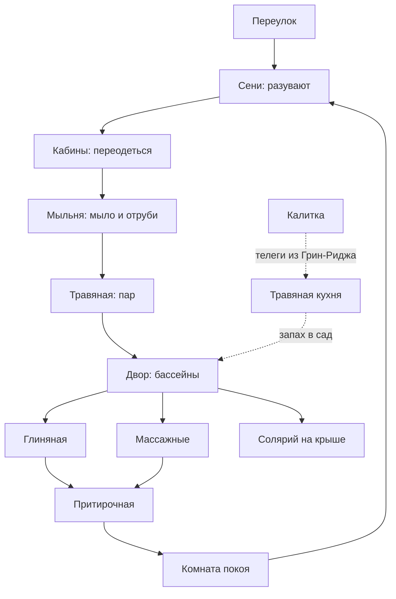

# Первоцвет


> [!info]- Локация — [[Плющевой квартал]], закрытый сад-спа при [[Конгломерат Парфюмеров|Конгломерате Парфюмеров]]
> **Тип:** банно-спа заведение высшего разряда, «зелёный люкс»
> **Держит:** [[Конгломерат Парфюмеров]], гранд-алхимик [[Аарнок Ксантисс]]
> **Персонал:** друиды Конгломерата, травницы, лешие
> **Правило заведения:** на клиента не накладывают заклинаний. Ни одного. Об этом говорят с гордостью.
> ⚠️ Заведения нет в Absalom CoLO — авторская локация на канонной гильдии.

За глухой стеной в переулке за Цветочной улицей нет вывески — только дверь и плющ по штукатурке, пущенный слишком ровными полосами, чтобы вырасти самому. За дверью город кончается. Внутри сад, которого не видно ни с одной улицы, и в нём тише, чем бывает в Абсаломе: небольшие бассейны в зелени, грядки, где каждая трава растёт на своей, и деревья, под которыми держат тень живые лешие. Здесь не делают вас другим человеком. Здесь три часа подряд занимаются тем человеком, которым вы уже являетесь, — и к вечеру вы впервые за годы видите в зеркале не усталость, а себя.

---

## Описание

### Снаружи

- **Запах:** с улицы ничего. Абсолютно ничего — и это первое, что странно в квартале, где пахнет всем сразу. Зато за дверью в лицо бьёт тёплой влажной зеленью, мокрой глиной и чем-то цветочным, чему нет названия.
- **Шум:** тишина. В Плющевом это противоестественно: вокруг уличные артисты, толпа, репетиции, а здесь глухо, как в погребе.
- **Ориентир:** переулок за [[Цветочная улица|Цветочной улицей]], глухая стена в плюще, дверь без вывески. Спросишь у прохожего — покажет не сразу, но покажет.

### Почему это выглядит именно так

[[Плющевой квартал]] — самый маленький по площади район города и самый плотно набитый. Земля здесь дороже, чем где-либо, и дворяне последний век скупают её под особняки с частными садами, выдавливая художников в переполненные общежития.

Поэтому **пустое место посреди Плющевого и есть главная вывеска.** Не позолота, а возможность не застраивать. Здание построено кольцом вокруг сада и смотрит внутрь, а не на улицу.

### Двор

- **Два малых бассейна** — тёплый у южной стены, прохладный в тени. Не для плавания, для сидения; в каждом помещается четверо, если по-дружески.
- **Шестнадцать грядок**, по траве на каждой, вдоль дорожек. С табличками, которые никто не читает, кроме травниц.
- **Солнечная поляна** — прогретая лужайка в углу, куда лешие приносят или убирают тень по слову.
- **Старая груша** посреди двора, старше здания. Её обходили, когда строили.

### Здание, по кольцу

- **Сени** — встречают, разувают, забирают верхнее. Ни кассы, ни очереди: платят на выходе.
- **Раздевальные кабины** — не общий зал, а шесть отдельных, с занавесью. За оставленным следят, но без демонстративной охраны: здесь это было бы оскорблением.
- **Мыльня** — тепло, вода, чёрное мыло, отруби, рукавицы.
- **Травяная** — комната пара, где на камни льют то, что при тебе срезали и заварили.
- **Три массажные кельи** — узкие, тёплые, лежак, окно в сад.
- **Глиняная** — прохладная, пять бочек разной земли по цветам.
- **Притирочная** — сердце заведения, см. ниже.
- **Комната покоя** — полутьма, лежаки, жаровни. Сюда уходят после всего и отсюда не хотят вставать.
- **Травяная кухня и сушильня** — служебное: котлы, сита, пучки под потолком. Гостям не сюда, но дверь всегда приоткрыта, и оттуда идёт запах.
- **Солярий на крыше** — плоская кровля с полотняными навесами, узкая лестница наверх.
- **Задний двор и калитка** — для телег с травой и цветами из [[Green Ridge|Грин-Риджа]]. Единственный второй выход.

### Схема

```
            переулок за Цветочной улицей
    ==================[ДВЕРЬ]==================
    |                  СЕНИ                   |   глухая стена в плюще
    +--------+---------------------+----------+
    | КАБИНЫ |                     |  МЫЛЬНЯ  |
    |   x6   |                     |          |
    +--------+       Д В О Р       +----------+
    |ТРАВЯНАЯ|   тёплый бассейн    | МАССАЖНЫЕ|
    |  (пар) |   старая груша      |    x3    |
    +--------+   прохладный б-н    +----------+
    |ГЛИНЯНАЯ|   16 грядок         |ПРИТИРОЧНАЯ|
    |        |   солнечная поляна  |          |
    +--------+---------------------+----------+
    | ПОКОЙ  |   ТРАВЯНАЯ КУХНЯ    | лестница |
    |        |   и сушильня        | на крышу |
    +--------+------[КАЛИТКА]------+----------+
                 задний двор, телеги

    НАВЕРХУ: солярий под полотняными навесами
```

**Маршрут гостя:**



**Что важно за столом:**
- **Одна дверь для гостей.** Вторая — калитка для телег, и через неё не ходят.
- **Двор виден отовсюду.** Все комнаты кольца смотрят окнами внутрь, и любой во дворе на виду у всего заведения. Приватность тут — в комнатах, а не в саду.
- **Притирочная последняя.** Маршрут построен так, чтобы клиент дошёл до полок с маслами распаренным и разнеженным. Это не гостеприимство, это торговля.

---

## Притирочная

Комната, ради которой это вообще гильдия парфюмеров.

Стены в полках от пола до потолка, и на полках **сотни горшков, склянок, флаконов и глиняных банок**, каждая с меткой, понятной только мастеру. Здесь не пахнет ничем — пока не откроют; это правило, и поэтому воздух в притирочной стоит холодный и пустой, как в аптеке.

Когда процедуры кончились, тебя приводят сюда мокрым, тёплым и распаренным, и мастер начинает открывать крышки одну за другой, поднося к твоему лицу.

Дальше сравнивают. **Розовая вода** — прозрачная, холодная, чистая до звона, будто кто-то распахнул окно. **Розовое масло** из того же цветка — густое, тяжёлое, сладкое почти до тошноты, и держится сутки. **Ирисовый корень** — сухая пудра, запах дорогого. **Нард** — тёмный, смолистый, взрослый. **Кедр** — как сухая доска на солнце.

Мастер не советует. Он **ждёт, на чём ты сам остановишься**, потому что, по здешнему убеждению, тело выбирает своё быстрее, чем голова.

Выбранным умащают на прогретую кожу. Это последнее, что с тобой делают, и уходишь ты уже пахнущим — в Абсаломе это читается за десять шагов, и читается как деньги.

---

## Заметки ГМа: как это описывать

> [!tip]- Сенсорная палитра — шпаргалка на сцену
> Разворачивать прямо во время игры. Не читать подряд — выхватывать одну строку.
>
> **Четыре приёма**
> 1. **Запах — не прилагательное, а предмет.** «Травяной аромат» не даёт ничего; «пахнет чердаком, где сушили бельё» даёт всё. Подставляй место или вещь, а не эпитет.
> 2. **Говори, что запах делает.** Оседает на языке. Сводит горло. Щиплет глаза. Стоит в носу ещё час после того, как вышел.
> 3. **У запаха есть вес и температура.** Холодный, острый, лёгкий — уходит сразу. Тёплый, густой, тяжёлый — ложится и держится. Одного этого слова уже хватает.
> 4. **Один запах, а не три.** Перечисление — каталог, его не запоминают. Одну точную деталь запоминают.
>
> **Материалы**
>
> | Что | Запах | На что похоже | Что делает | Вес |
> |---|---|---|---|---|
> | Чёрное мыло | маслянистое, землистое, чуть горькое | разведённая земля, оливковая косточка | кожа делается скользкой и чужой | тёплый |
> | Пшеничные отруби | сухое, хлебное, пыльное | корка хлеба, мешок муки | трёт мягко, поскрипывает | лёгкий |
> | Чёрная глина | минеральный холод | погреб, дождь по камню | тянет, холодит, сохнет коркой | холодный |
> | Красная глина | железистое, чуть кровяное | ржавый гвоздь, мокрый кирпич | греет изнутри | тёплый |
> | Белая глина | почти никакое, меловое | школьный мел | стягивает лицо в маску | сухой |
> | Жёлтая глина | прелое, земляное | палая листва | вязкая, липнет | тёплый |
> | Синяя глина | солоноватое, илистое | дно пруда | плотная, прохладная | холодный |
> | Розовая вода | чистое до звона | распахнутое окно | освежает и уходит | лёгкий |
> | Розовое масло | густое, сладкое до тошноты | переспелые лепестки | ложится и держится сутки | тяжёлый |
> | Ирисовый корень | пудра, сухое, фиалковое | бабушкина пудреница | «запах дорогого» | сухой |
> | Кедр | смолистое, сухое | доска на солнце | оседает в одежде | тёплый |
> | Нард | смолисто-горькое, землистое | старая церковь | взрослый, давящий | тяжёлый |
> | Берёзовый веник | свежее, почти мятное | молодой лист после дождя | колет и бодрит | лёгкий |
> | Дубовый веник | тёплая пыль, дубление, винно-кислое | бочка, кора | прибивает жар к спине | тяжёлый |
> | Ивовый веник | горьковатое, аптечное | растёртая кора | щиплет, «лечебное» | средний |
> | Пар с ромашкой | сенное, тёплое | чужой дом, где тебя лечили | садится на лицо | тёплый |
> | Мокрый камень | минеральное, никакое | колодец | холодит ладонь | холодный |
> | Мёд с молоком | животное, сладкое | тёплое молоко с пенкой | липнет к пальцам | тяжёлый |
> | Срезанная зелень | резкое, сочное | скошенная трава | бьёт в нос сразу | лёгкий |
> | Дым флейлифа | сладковато-тлеющее | тлеющий сеновал | тяжелит веки | тяжёлый |
> | Маковое молоко | почти никакое, ореховое | миндаль, мел | тепло разливается от горла | тёплый |
>
> **Глаголы** (нарратив держится на них, а не на эпитетах)
> - **Кожа:** стягивается · горит · скользит · зудит · дышит · немеет
> - **Пар:** садится · опускается · обваривает · стоит стеной · ходит волнами
> - **Масло:** ложится · впитывается · тянется · блестит
> - **Глина:** сохнет коркой · трескается · тянет · холодит
> - **Веник:** прибивает жар · хлещет · обмахивает · прижимает
> - **Запах:** оседает · стоит · уходит · липнет · бьёт · разворачивается
>
> **Готовые фразы**
> - «На камни плеснули, и на секунду стало нечем дышать. Потом пар опускается — и это ромашка, тёплое, сенное, как в чужом доме, где тебя когда-то лечили.»
> - «Первое движение рукавицы — и с тебя сходит серыми катышками то, что ты носил на себе, не зная. Это стыдно и невероятно приятно одновременно.»
> - «Глина сохнет коркой, и лицо перестаёт быть твоим: ты чувствуешь его как маску, надетую поверх.»
> - «Он открывает вторую склянку. Тот же цветок — но густое, сладкое, тяжёлое, и ты понимаешь, что к вечеру от этого заболит голова.»
> - «Веник прибивает жар к спине, и ты в первый раз за неделю перестаёшь думать.»
> - «Пахнет ничем. Это дороже всего остального в комнате.»
> - «Вода такая тёплая, что тело перестаёт понимать, где кончается оно и начинается она.»
> - «Ты выходишь на улицу, и город бьёт в нос всем сразу — рыбой, дымом, толпой. Полчаса назад ты этого не замечал.»

---

## Поисковые якоря

#локация #Абсалом #ПлющевойКвартал #спа #бани #КонгломератПарфюмеров #Арка2
