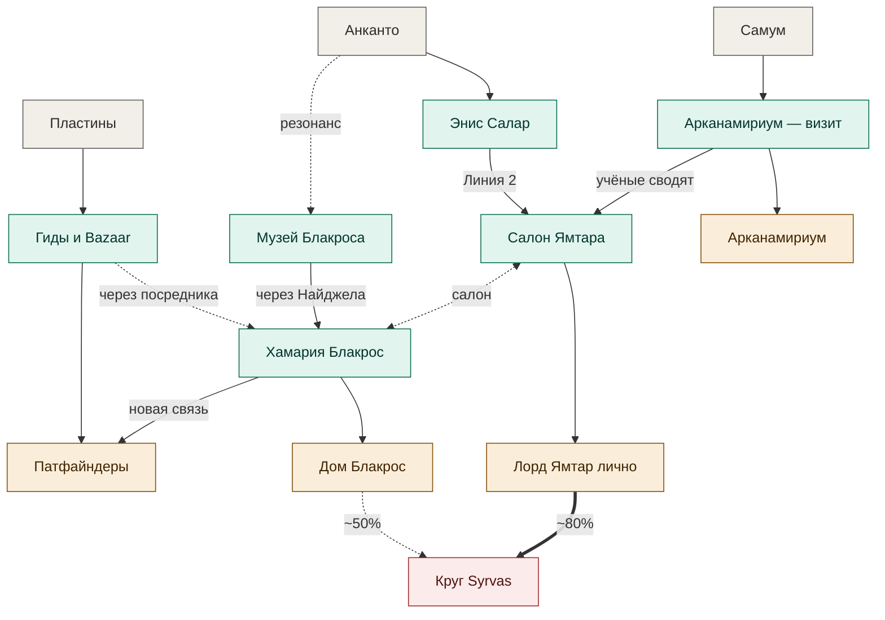

# Граф связей кампании Азланти

> [!note]- Назначение
> Живой граф связей между PC, NPC, фракциями, локациями и сюжетными нитями кампании. Не справочник по покупателям одного артефакта — а общая карта «кто на кого выходит и почему».
>
> **Как пользоваться:**
> - Графы внутри файла рендерятся через Mermaid прямо в Obsidian
> - Цветовая семантика единая по всем графам: серый — что у партии в руках, бирюзовый — мосты и узлы (открытые), амбер — финальные точки выбора, красный — скрытые получатели/угрозы
> - Толщина стрелок к скрытым узлам = вероятность утечки
> - Перекрёстные связи, которые в граф не помещаются — в проз под графом
> - При расширении: новый граф = новый раздел `## Граф: <тема>`. Старые не удаляем

**Последнее обновление:** старт работы над Аркой 2 (Граф 1: пути продажи пластин)
**Статус:** живой документ, расширяется по ходу кампании

---

## Граф 1: пути продажи пластин (Арка 2)

### Расшифровка узлов

**PC-входы (то с чем партия пришла в Абсалом):**
- **Пластины** — пульт KAERETHAL, азлантийский артефакт из руин под Гринфордом
- **Анканто** — меч-эйдолон Микаэля, ангельская природа, требует понимания
- **Самум** — слепой кинетик, в его бэкстори учёный-NPC прямо направил в Арканамириум

**Мосты в Абсаломе:**
- **Гиды и Bazaar** — городские слухи, посредники на рынке, любой житель указывает первое направление
- **[[Энис Салар]]** — жрец Саренрей при [[House of Healing]] (Ivy District), друг Варена
- **Музей Блакроса** — Wise Quarter, свободный вход, куратор [[Найджел Олдейн]] (бывший Патфайндер)
- **Арканамириум — визит** — академия магии, экспертиза реликвий

**Узловые сцены (хабы):**
- **Салон Ямтара** — Дворец Ормуз, регулярные собрания учёных и коллекционеров
- **[[Хамария Блакрос]]** — сцион-леди дома, активная коллекционерка, после разрыва с Ониксовым альянсом тянется к Патфайндерам

**Покупатели:**
- **Патфайндерское общество** — ложа в Foreign Quarter, ~500 gp, репутация
- **Дом Блакрос** — через Хамарию, в её коллекцию (с побочной сюжеткой Анканто/секта Визиря)
- **[[Лорд Ямтар (Дом Ормуз)|Лорд Ямтар лично]]** — в его частную коллекцию во Дворце Ормуз. Не институция Ормуз, а он персонально
- **Арканамириум как фракция** — экспертиза + потенциальная конфискация под видом «договора»

**Скрытое:**
- **[[Досье_Круга_Syrvas|Круг Syrvas]]** — получает утечку только через два дома: ~80% при продаже Ямтару (через [[Эларион Меретис|Элариона]] на салоне), ~50% при продаже Хамарии (через её обмен с салоном). Патфайндеры и Арканамириум блокируют утечку

### Перекрёстные связи (не в графе)

Связи которые есть, но загромоздили бы граф:

- **Музей Блакроса → Патфайндеры**: куратор [[Найджел Олдейн]] — бывший Патфайндер, может направить «отнесите в Общество, у меня там старые знакомые»
- **Арканамириум ↔ Патфайндеры**: общая академическая среда, обмен по азлантийскому языку. Grand Archive Патфайндеров и Релик-исследования Арканамириума пересекаются
- **Хамария → Найджел Олдейн**: муж Lady Dhrami, доверенный куратор. Канал «партия впечатлила музей → встреча с Хамарией»
- **[[Эларион Меретис]] на салоне Ямтара**: ключевая точка утечки. Не покупатель, но всегда рядом, всегда слушает
- **Грэнд Архив Патфайндеров → Тарвен и Варен**: саренитская сеть Микаэля пересекается с архивом Общества

### Особенности механики

- **Никто из «хороших людей» не знает полной картины.** Энис не знает что ведёт в Круг. Ямтар подозревает но не копает. Хамария — невольный донор. Найджел — честный бывший Патфайндер. Это by design.
- **Утечка вероятностная, не детерминированная.** 50% и 80% — реальные шансы, не гарантии. Это не рельса.
- **Темп Йорена.** Йорен Орувиэль появляется только после того как партия побывала в Лужах И его информация подтвердилась через Ямтара/Хамарию. До этого он невидим.

---

## Будущие графы (TODO)

Раздел заготовка — наращиваем по мере работы.

### Граф 2: личные арки PC и их триггеры в Абсаломе
- [[Гельдала (Егорушка)|Гельдала]] ↔ Леди Сейчия (Солевой картель, родословная)
- [[Киран (Лиля)|Киран]] ↔ Ироройум, статуэтка Ирори, триггеры диссоциации в Лужах
- Микаэль/[[Анканто]] ↔ секта Визиря через Музей Блакроса
- Самум ↔ пульт KAERETHAL ↔ дом-родина

### Граф 3: Сеть Круга Syrvas в Абсаломе
- Семёрка ([[Валастир Каэрваль]], [[Эларион Меретис]], [[Йорен Орувиэль]], [[Савийя Талорин]], [[Маэлис Сот-Ану]], [[Дорен Виракон]], [[Лисера Кетхарин]])
- Доноры: Дом Ормуз (через Ямтара), Дом Дамак
- Витрина в Лужах: [[Хоуп]], [[Приют Хоуп]], мастерские
- Невидимая координация: кто кому передаёт информацию

### Граф 4: Война нитей (Совет Лордов и фракции Абсалома)
- Магорды и претенденты в примархи
- Леди Дарчана (Арканамириум) ↔ Ксансиппа (Тевинег)
- Дом Блакрос ↔ Авид Арнсен
- Кандрэн ↔ Тевинег вражда (Шорлайн, харбормастер)
- Где партия может случайно засветиться

### Граф 5: Глобальные треки Ордена Азланти
- Стандарт ↔ 6 артефактов KAERETHAL (один из них — пульт партии)
- Мифическая линия ↔ фрагменты Дождя Годзраин + якорь
- Матрицы автоматонов

### Граф 6 (будущее, Арка 3+): домашние регионы PC
- Когда партия начнёт посещать родину каждого

---

## Поисковые якоря

#граф #связи #карта #Арка2 #Арка3 #КругSyrvas #Орден_Азланти #рабочий_документ #живой_документ
